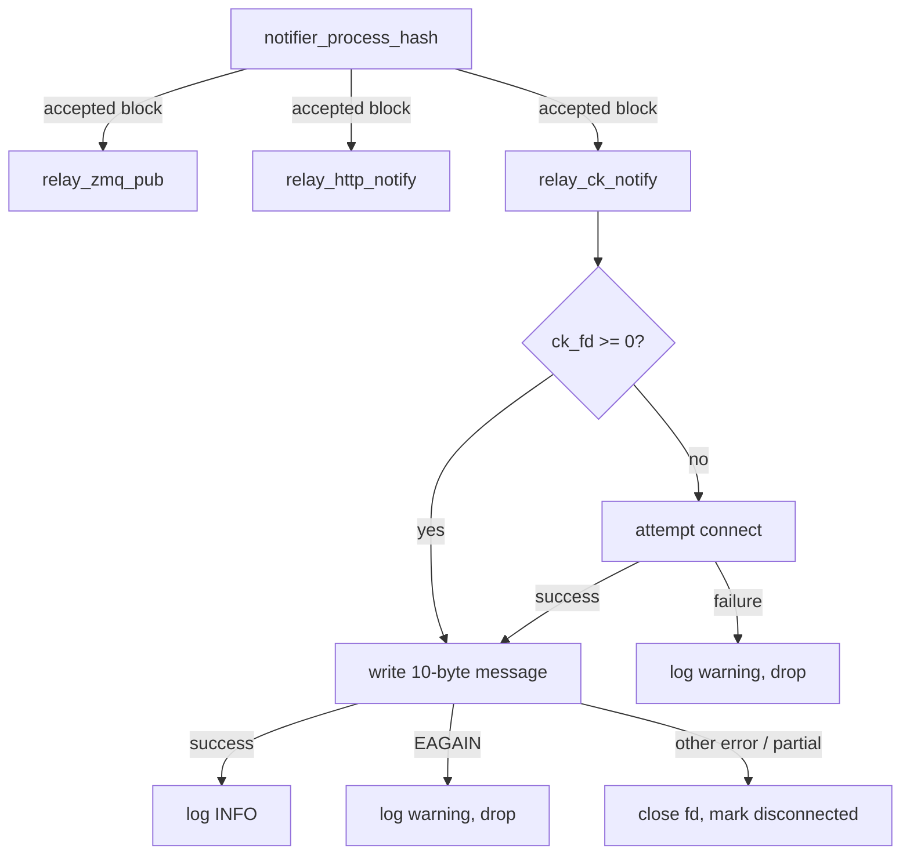

# Design Document: ck-notify-socket

## Overview

This feature adds an optional CK socket relay to rpcrace's downstream notification pipeline. When configured, the relay connects to ckpool's stratifier Unix domain socket and sends a length-prefixed "update" command each time a new block is accepted. This provides a direct, low-latency notification path to ckpool without requiring an intermediate ZMQ or HTTP hop.

The relay is designed as a simple fire-and-forget mechanism: one non-blocking write per notification, no buffering, automatic reconnection on failure. It integrates into the existing `notifier_process_hash` relay pipeline alongside the ZMQ PUB and HTTP notify relays, with full fault isolation between the three paths.

### Design Rationale

- **Non-blocking single-write**: The stratifier socket is local and the message is tiny (10 bytes). A single `write()` either succeeds immediately or the notification is dropped. This avoids write buffering complexity and prevents a misbehaving ckpool from stalling the event loop.
- **Reconnect-on-demand**: Rather than maintaining a persistent reconnection timer, the relay attempts to reconnect only when a new notification arrives. Block intervals are ~10 minutes, so the overhead of one `connect()` per notification after a disconnect is negligible.
- **No epoll registration**: The CK socket fd is not added to the event loop. Writes are triggered synchronously from the relay pipeline. Since writes are non-blocking and the message is small, there's no need for EPOLLOUT handling.

## Architecture



The CK socket relay is a self-contained state machine embedded within the `notifier_t` struct. It has two states:
1. **Connected** (`ck_fd >= 0`): ready to send
2. **Disconnected** (`ck_fd == -1`): will reconnect on next notification

## Components and Interfaces

### 1. Config Extension (`config.h` / `config.c`)

Add a new field to `config_t`:

```c
char ck_notify_socket[108];  /* Unix socket path, empty = disabled */
```

The 108-byte buffer matches `sizeof(struct sockaddr_un.sun_path)` on Linux, accommodating paths up to 107 characters plus a NUL terminator.

Parsing logic in `config_load()`:
- If `"ck_notify_socket"` key is present and is a string of length 1–107: store in buffer.
- If absent or empty string: set buffer to empty (first byte NUL).
- If string length > 107: log error, return NULL.
- If present but not a string type: log error, return NULL.

### 2. CK Relay State (within `notifier_t`)

Add fields to the `notifier` struct:

```c
/* CK socket relay state */
int ck_fd;                    /* Unix socket fd, -1 if disconnected */
char ck_path[108];            /* configured socket path */
bool ck_configured;           /* true if path is non-empty */
```

### 3. Internal Functions (within `notifier.c`)

```c
/* Attempt to connect to the CK stratifier socket.
 * Returns the connected fd (set to O_NONBLOCK), or -1 on failure. */
static int ck_connect(const char *path);

/* Send the "update" command to ckpool via the CK socket relay.
 * Handles write errors, reconnection, and logging. */
static void relay_ck_notify(notifier_t *n, const uint8_t *hash);
```

### 4. Integration Point

In `notifier_process_hash()`, after the existing relay calls:

```c
/* Downstream relay: CK socket notify */
relay_ck_notify(n, hash);
```

This call is placed after `relay_zmq_pub` and `relay_http_notify` so that the latency-critical ckpool notification is sent last (after ZMQ/HTTP which may have subscribers expecting first delivery). However, all three are in the same synchronous code path, so ordering is a minor concern.

### 5. Config Warning Update

The existing startup warning in `config_load()` that checks for no downstream method must be updated to also check `ck_notify_socket`:

```c
if (cfg->zmq_server_port == 0 && cfg->notify_http_url[0] == '\0' &&
    cfg->ck_notify_socket[0] == '\0') {
    log_msg(LOG_WARN, "[config] No downstream notification method configured");
}
```

## Data Models

### Message Format

The ckpool stratifier expects a length-prefixed message:

| Offset | Size | Content | Description |
|--------|------|---------|-------------|
| 0 | 4 bytes | `0x06 0x00 0x00 0x00` | Length prefix (uint32_t LE, value = 6) |
| 4 | 6 bytes | `update` | ASCII payload (no NUL terminator) |

Total: 10 bytes, sent as a single contiguous buffer in one `write()` call.

```c
static const uint8_t CK_UPDATE_MSG[10] = {
    0x06, 0x00, 0x00, 0x00,       /* length prefix: 6 in LE */
    'u', 'p', 'd', 'a', 't', 'e'  /* payload */
};
```

### State Transitions

```
                 ┌─────────────────┐
                 │  DISCONNECTED   │
                 │   (ck_fd = -1)  │
                 └────────┬────────┘
                          │ notification arrives
                          ▼
                 ┌─────────────────┐
                 │ connect attempt │
                 └───┬─────────┬───┘
              success│         │failure
                     ▼         ▼
           ┌──────────────┐   drop notification
           │  CONNECTED   │   log warning
           │ (ck_fd >= 0) │   stay DISCONNECTED
           └──────┬───────┘
                  │ write()
        ┌─────────┼──────────────┐
        │         │              │
    success    EAGAIN      error/partial
        │         │              │
        ▼         ▼              ▼
   log INFO   drop (warn)   close(fd)
   stay CONN  stay CONN     → DISCONNECTED
```

## Correctness Properties

*A property is a characteristic or behavior that should hold true across all valid executions of a system — essentially, a formal statement about what the system should do. Properties serve as the bridge between human-readable specifications and machine-verifiable correctness guarantees.*

### Property 1: Valid socket path round-trip

*For any* string of length 1 to 107 containing valid path characters, if that string is placed in a JSON config as the `"ck_notify_socket"` value and parsed by `config_load`, then the resulting `config_t.ck_notify_socket` field SHALL contain exactly that string (byte-for-byte equal).

**Validates: Requirements 1.1**

### Property 2: Over-length path rejection

*For any* string of length 108 or greater, if that string is placed in a JSON config as the `"ck_notify_socket"` value and parsed by `config_load`, then `config_load` SHALL return NULL.

**Validates: Requirements 1.3**

### Property 3: Non-string type rejection

*For any* JSON value that is not of string type (integer, boolean, null, array, or object), if that value is placed in a JSON config as the `"ck_notify_socket"` value and parsed by `config_load`, then `config_load` SHALL return NULL.

**Validates: Requirements 1.4**

### Property 4: Message framing invariant

*For any* invocation of the CK socket relay (regardless of block hash content), the bytes written to the socket SHALL be exactly the 10-byte sequence `{0x06, 0x00, 0x00, 0x00, 'u', 'p', 'd', 'a', 't', 'e'}` with no additional bytes.

**Validates: Requirements 3.1, 3.2**

### Property 5: Single write per notification

*For any* block notification processed by the CK socket relay while in connected state, the relay SHALL issue exactly one `write()` system call — no retry loop, no subsequent write attempts for the same notification event.

**Validates: Requirements 4.1**

### Property 6: Fatal error causes disconnect

*For any* `write()` return value that indicates an error other than EAGAIN/EWOULDBLOCK, or any partial write (0 < n < 10), the CK socket relay SHALL close the fd and transition to disconnected state (fd = -1).

**Validates: Requirements 4.4, 4.5, 5.1**

### Property 7: Reconnection on demand

*For any* block notification arriving when the CK socket relay is in disconnected state, the relay SHALL attempt to create a new Unix domain socket and connect to the configured path before attempting the write.

**Validates: Requirements 5.2**

### Property 8: Fault isolation from CK relay

*For any* CK socket relay failure (connection failure or write error), the ZMQ PUB relay and HTTP notify relay invocations for the same block hash SHALL still execute successfully (the CK relay failure does not propagate).

**Validates: Requirements 6.2**

## Error Handling

| Condition | Action | Recovery |
|-----------|--------|----------|
| `connect()` fails at startup | Log WARN `[ck]`, continue with `ck_fd = -1` | Reconnect on next notification |
| `write()` returns EAGAIN/EWOULDBLOCK | Log WARN `[ck]`, drop notification | Stay connected, try next notification |
| `write()` returns other error | Log WARN `[ck]`, `close(fd)`, set `ck_fd = -1` | Reconnect on next notification |
| `write()` returns partial (0 < n < 10) | Log WARN `[ck]`, `close(fd)`, set `ck_fd = -1` | Reconnect on next notification |
| `socket()` fails during reconnect | Log WARN `[ck]`, drop notification | Try again on next notification |
| `connect()` fails during reconnect | Log WARN `[ck]`, `close(fd)`, drop notification | Try again on next notification |
| Config path > 107 chars | `config_load` returns NULL | Operator must fix config |
| Config path not a string | `config_load` returns NULL | Operator must fix config |

All error paths in the CK relay are isolated — they log and return without affecting the caller (`notifier_process_hash`) or sibling relays.

## Testing Strategy

### Unit Tests (example-based)

| Test | Validates |
|------|-----------|
| Config with valid `ck_notify_socket` path → stored correctly | Req 1.1 |
| Config without `ck_notify_socket` → empty string, relay disabled | Req 1.2 |
| Config with empty string → relay disabled | Req 1.2 |
| Config with path > 107 chars → `config_load` returns NULL | Req 1.3 |
| Config with non-string value → `config_load` returns NULL | Req 1.4 |
| Startup connect failure → log warning, continue | Req 2.2 |
| Connected fd has O_NONBLOCK set | Req 2.3 |
| Successful write → INFO log with `[ck]` and hex hash | Req 4.2, 8.2 |
| EAGAIN on write → drop, warning logged | Req 4.3 |
| Partial write → close, disconnect | Req 4.5 |
| Reconnection on next notification after disconnect | Req 5.2, 5.4 |
| Failed reconnection → warning, notification dropped | Req 5.3 |
| CK relay failure doesn't affect ZMQ/HTTP relay | Req 6.2, 6.3 |
| Disabled relay produces no log output | Req 8.4 |
| Clean shutdown closes fd | Req 7.1 |
| Shutdown when disconnected → no crash | Req 7.2 |

### Property-Based Tests

Property-based testing is appropriate for this feature's config parsing logic and message framing. The relay logic itself is I/O-bound but can be tested with mock fds (socketpair or pipes).

**Library**: Custom property test harness (C, using random generation with `rand()` and fixed iteration counts — consistent with project's existing test style in `tests/`).

**Configuration**:
- Minimum 100 iterations per property test
- Each test tagged with property reference comment

| Property Test | Tag |
|---------------|-----|
| Valid path round-trip | Feature: ck-notify-socket, Property 1: valid socket path round-trip |
| Over-length rejection | Feature: ck-notify-socket, Property 2: over-length path rejection |
| Non-string type rejection | Feature: ck-notify-socket, Property 3: non-string type rejection |
| Message framing invariant | Feature: ck-notify-socket, Property 4: message framing invariant |
| Single write per notification | Feature: ck-notify-socket, Property 5: single write per notification |
| Fatal error causes disconnect | Feature: ck-notify-socket, Property 6: fatal error causes disconnect |
| Reconnection on demand | Feature: ck-notify-socket, Property 7: reconnection on demand |
| Fault isolation | Feature: ck-notify-socket, Property 8: fault isolation from CK relay |

### Integration Tests

- End-to-end: start a mock Unix listener, configure rpcrace, trigger block notification via ZMQ, verify 10-byte message received on listener.
- Reconnection: close listener mid-session, trigger notification (expect reconnect failure), restart listener, trigger next notification (expect reconnect + message).
