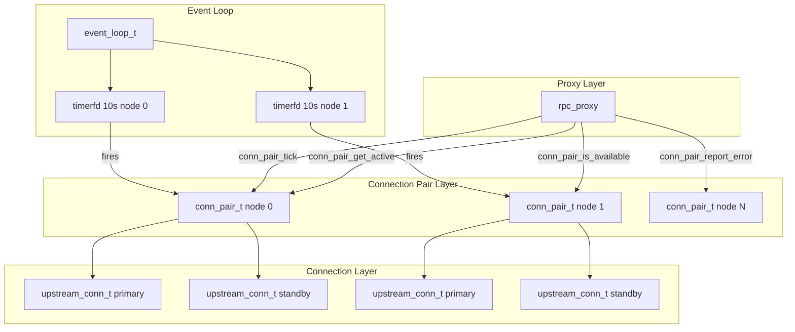
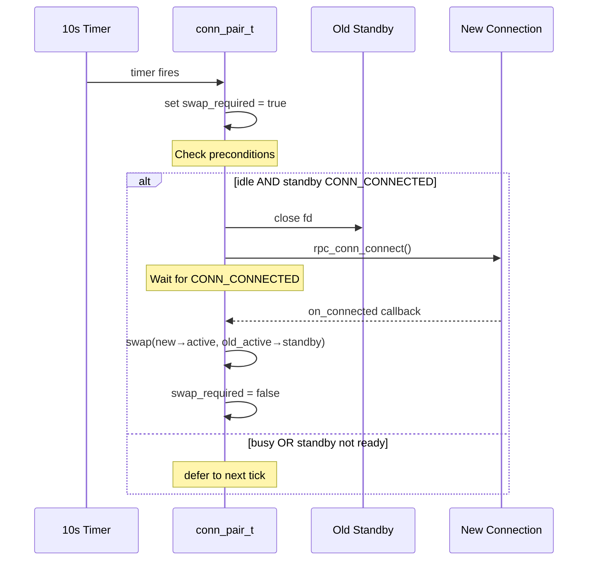
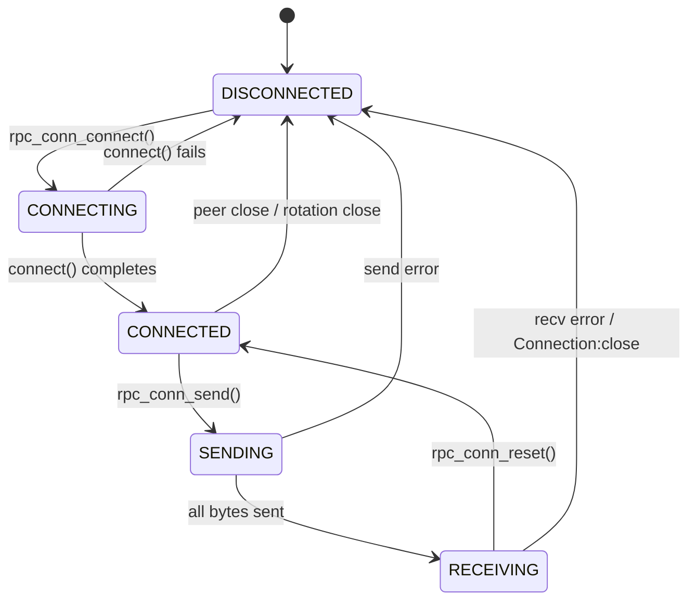

# Design Document: conn-pair-refactor

## Overview

This design replaces the existing upstream connection management in rpcrace — exponential backoff, CONN_DEAD state, RACE_RETRY_WAIT state machine, and synthetic RPC error generation — with a "connection pair" abstraction. Each upstream Bitcoin node is managed by a `conn_pair_t` that maintains two TCP connections (active and standby) and rotates them on a fixed 10-second timer. The proxy layer interacts with connection pairs through a narrow interface (`conn_pair_get_active`, `conn_pair_is_available`, `conn_pair_report_error`, `conn_pair_tick`) and never sees dual-connection internals.

The core insight: bitcoind closes idle connections after ~30 seconds. By rotating every 10 seconds, the active connection is always fresh (at most 10 seconds old). The standby provides instant failover on transport errors without retry loops or backoff.

**Key design decisions:**

1. **No retry state machine** — Error recovery is a single swap + retry. If both connections fail, the client connection is closed and the downstream stratum proxy handles reconnection.
2. **No exponential backoff** — The 10-second rotation timer is the only reconnection mechanism. It fires unconditionally and attempts reconnection on each tick.
3. **No synthetic errors** — When all nodes are unreachable, the proxy closes the client TCP connection without writing any response bytes. The downstream stratum proxy interprets the connection drop and reconnects.
4. **Fixed 10-second interval** — Hardcoded, not configurable, not adaptive. Simple and predictable.

## Architecture



**Data flow for a request:**

1. Client sends HTTP+JSON-RPC request to proxy listener
2. Proxy parses method, classifies route strategy (race/sticky/broadcast)
3. For each targeted node, proxy calls `conn_pair_get_active(pair)` to get the `upstream_conn_t*`
4. Proxy calls `rpc_conn_send(conn, buf, len)` directly on the returned connection
5. On transport error callback, proxy calls `conn_pair_report_error(pair)` which swaps connections
6. If swap returns available, proxy retries once on new active connection
7. On response callback, proxy processes the race/sticky/broadcast completion logic

**Rotation lifecycle (per node):**



## Components and Interfaces

### New Module: `conn_pair.h` / `conn_pair.c`

```c
/* conn_pair.h — Connection pair: active + standby with 10s rotation */

#ifndef CONN_PAIR_H
#define CONN_PAIR_H

#include "rpc_conn.h"
#include "event_loop.h"
#include "config.h"

#include <stdbool.h>

typedef struct conn_pair conn_pair_t;

/* Initialize a connection pair for a node.
 * Allocates two upstream_conn_t, arms rotation timer, initiates both connects.
 * Returns 0 on success, -1 on failure (partial resources freed). */
int conn_pair_init(conn_pair_t *pair, event_loop_t *loop,
                   node_config_t *config, int node_index);

/* Destroy a connection pair. Closes both connections, disarms timer, frees memory. */
void conn_pair_destroy(conn_pair_t *pair);

/* Get the active connection. Returns pointer to upstream_conn_t if active
 * is in CONN_CONNECTED state, NULL otherwise. */
upstream_conn_t *conn_pair_get_active(conn_pair_t *pair);

/* Check if this node is available (active connection in CONN_CONNECTED state). */
bool conn_pair_is_available(const conn_pair_t *pair);

/* Report a transport error on the active connection.
 * Swaps active/standby unconditionally.
 * Returns true if new active is CONN_CONNECTED (available for retry). */
bool conn_pair_report_error(conn_pair_t *pair);

/* Called by the rotation timer callback. Evaluates whether rotation
 * preconditions are met and executes rotation if so.
 * Also called after a request completes to check deferred rotation. */
void conn_pair_tick(conn_pair_t *pair);
```

**Internal structure:**

```c
#define CONN_PAIR_ROTATION_INTERVAL_MS 10000

struct conn_pair {
    /* The two connections — slot[0] and slot[1] */
    upstream_conn_t slots[2];

    /* Which slot index (0 or 1) is currently the active connection */
    int active_idx;

    /* Rotation state */
    bool swap_required;       /* set by timer, cleared after successful swap */
    int rotation_timer_fd;    /* recurring 10s timerfd */

    /* References */
    event_loop_t *loop;
    node_config_t *config;
    int node_index;
};
```

### Modified Module: `rpc_conn.h` / `rpc_conn.c`

**Removed:**
- `CONN_DEAD` enum value
- `RECONNECT_DEAD_THRESHOLD` constant
- `RECONNECT_MAX_MS` constant
- `rpc_conn_schedule_reconnect()` function
- `rpc_conn_try_reconnect()` function
- `reconnect_attempts`, `next_reconnect_ns`, `reconnect_base_ms` fields

**Modified:**
- `rpc_conn_reset()` — when `connection_close` is set, disconnects without scheduling reconnect (conn_pair rotation handles refresh)
- `conn_state_t` enum — remove `CONN_DEAD`

**Preserved:**
- `rpc_conn_init()`, `rpc_conn_connect()`, `rpc_conn_send()`, `rpc_conn_disconnect()`, `rpc_conn_destroy()`
- `rpc_conn_response_complete()`, `rpc_conn_get_response()`
- `rpc_conn_reset()` (modified behavior)
- `configure_socket()` helper
- All HTTP framing logic (parse_headers, content_length, header_len)
- All callback infrastructure (`conn_callbacks_t`)

### Modified Module: `rpc_proxy.h` / `rpc_proxy.c`

**Removed:**
- `RACE_RETRY_WAIT` state
- `enter_retry_wait()`, `retry_poll_cb()`, `retry_deadline_cb()` functions
- `send_rpc_error_to_client()` function
- `retry_timer_fd`, `retry_deadline_timer_fd`, `retry_attempts`, `is_post_notify_gbt` fields

**Modified:**
- `struct rpc_proxy` — replace `upstream_conn_t upstreams[MAX_NODES]` with `conn_pair_t pairs[MAX_NODES]`
- `dispatch_fanout()` — iterate `pairs[]`, use `conn_pair_get_active()` instead of checking `conn->state`
- `dispatch_sticky()` — use `conn_pair_get_active(pairs[sticky_idx])`
- `on_upstream_error()` — call `conn_pair_report_error()`, retry once if available
- All-nodes-unreachable handling — close client TCP connection instead of sending synthetic error
- Broadcast retry — on transport error, swap + retry once per node

**Preserved:**
- `race_state_t` with `RACE_IDLE`, `RACE_FANOUT`, `RACE_STICKY` (no `RACE_RETRY_WAIT`)
- `classify_method()` routing logic
- `parse_http_request()`, `extract_json_rpc_method()`
- `response_is_error()`, `parse_gbt_height()`, GBT height comparison
- Listener setup, client connection management
- RPC timeout timer
- Stats recording

### Preserved Modules (no changes)

- `event_loop.h` / `event_loop.c` — no API changes needed
- `config.h` / `config.c` — `reconnect_delay_ms` field kept in config but ignored (backward compat)
- `http_server`, `stats`, `notifier`, `watchdog`, `log`, `util`

### Critical: Notify + GBT Race Interaction (preserved exactly)

The notifier sets a `notify_pending` flag when a block notification arrives. rpcrace does **not** initiate a GBT request on its own — it only races when the stratum proxy sends a `getblocktemplate` request. The sequence:

1. Notifier receives block notification → sets `notify_pending = true`
2. Next incoming `getblocktemplate` from stratum proxy sees `notify_pending` → classified as ROUTE_RACE (fan-out)
3. Race timers (RPC timeout, stall detection) apply to **that** incoming request
4. If a GBT is already in-flight when notify arrives, the current request continues as-is; `notify_pending` causes the *next* GBT to race

This logic is entirely within the proxy's request classification and dispatch path. The conn_pair refactor does not touch it — conn_pair only provides the connection; routing decisions remain in rpc_proxy.

## Data Models

### Connection State Machine (simplified)



Note: `CONN_DEAD` is removed entirely. A connection is either usable or in `CONN_DISCONNECTED`/`CONN_CONNECTING`.

### Connection Pair State

| Field | Type | Description |
|-------|------|-------------|
| `slots[2]` | `upstream_conn_t` | Two connection slots |
| `active_idx` | `int` | 0 or 1, index of current active slot |
| `swap_required` | `bool` | Set by timer, cleared after successful rotation |
| `rotation_timer_fd` | `int` | timerfd for 10s rotation cycle |
| `loop` | `event_loop_t*` | Event loop reference |
| `config` | `node_config_t*` | Node configuration (host, port, label) |
| `node_index` | `int` | Index in proxy's pairs array |

### Proxy Structure Changes

**Before:**
```c
upstream_conn_t upstreams[MAX_NODES];
int upstream_count;
int retry_timer_fd;
int retry_deadline_timer_fd;
int retry_attempts;
bool is_post_notify_gbt;
```

**After:**
```c
conn_pair_t pairs[MAX_NODES];
int pair_count;
```

### File Descriptor Budget

| Resource | Count | Per-node |
|----------|-------|----------|
| Upstream connections | 2 × N | 2 |
| Rotation timerfd | 1 × N | 1 |
| Listener socket | 1 | — |
| Client socket | 1 | — |
| Epoll fd | 1 | — |
| RPC timeout timerfd | 1 | — |
| Stall detection timerfd | 1 | — |
| **Total (16 nodes)** | **53** | — |

## Correctness Properties

*A property is a characteristic or behavior that should hold true across all valid executions of a system — essentially, a formal statement about what the system should do. Properties serve as the bridge between human-readable specifications and machine-verifiable correctness guarantees.*

### Property 1: Availability reflects active connection state

*For any* conn_pair_t in any combination of slot states, `conn_pair_is_available(pair)` SHALL return true if and only if `pair->slots[pair->active_idx].state == CONN_CONNECTED`, and `conn_pair_get_active(pair)` SHALL return non-NULL if and only if the same condition holds.

**Validates: Requirements 1.1, 1.2, 6.1**

### Property 2: Error-triggered swap is unconditional

*For any* conn_pair_t and any standby connection state (CONN_DISCONNECTED, CONN_CONNECTING, or CONN_CONNECTED), calling `conn_pair_report_error(pair)` SHALL swap `active_idx` such that the former standby slot becomes the new active and the former active becomes the new standby.

**Validates: Requirements 1.3, 4.1, 9.3**

### Property 3: Timer-driven rotation respects preconditions

*For any* conn_pair_t state, a timer-driven rotation SHALL execute if and only if: (a) `swap_required` is true, AND (b) the active connection is in CONN_CONNECTED state (idle — not SENDING or RECEIVING), AND (c) the standby connection is in CONN_CONNECTED state. When any precondition is not met, the rotation SHALL be deferred and `swap_required` SHALL remain true.

**Validates: Requirements 3.2, 3.3, 9.1, 9.2, 9.4**

### Property 4: Primary freshness invariant

*For any* conn_pair_t after a successful rotation completes, the active connection SHALL be the most recently established connection (the connection that was opened during this rotation cycle as the new standby and then swapped to active).

**Validates: Requirements 3.8**

### Property 5: Single retry semantics

*For any* RPC request that encounters a transport-level failure, the proxy SHALL retry the request at most once (on the swapped-in connection if available). A double failure on the same node SHALL result in that node being treated as unavailable for the current request with no further retry attempts.

**Validates: Requirements 5.2, 5.4, 5.7**

### Property 6: Fan-out race continuation

*For any* fan-out race with N targeted nodes where K nodes (K < N) experience double failures, the race SHALL continue with the remaining (N - K) nodes that have not failed, and the race result SHALL be determined by those remaining responses.

**Validates: Requirements 5.5**

### Property 7: All-unavailable closes client

*For any* RPC request (race, sticky, or broadcast) where all upstream conn_pairs report unavailable at dispatch time, or where all dispatched requests complete with errors/timeouts and no success has been forwarded, the proxy SHALL close the client TCP connection without writing any response bytes.

**Validates: Requirements 7.1, 7.2, 7.3, 7.5**

### Property 8: Broadcast targets exactly available nodes

*For any* set of conn_pairs with varying availability, a broadcast dispatch SHALL send the request to every conn_pair where `conn_pair_is_available()` returns true, and SHALL skip every conn_pair where it returns false.

**Validates: Requirements 8.1, 8.2**

### Property 9: Broadcast all-complete semantics

*For any* broadcast method dispatched to N available nodes, the proxy SHALL wait for all N responses (or transport failures) before determining the race result. No in-flight request SHALL be aborted.

**Validates: Requirements 8.5**

### Property 10: Method routing classification

*For any* method string, `classify_method()` SHALL return: ROUTE_RACE for "getblocktemplate" (when notify_pending or no sticky), ROUTE_STICKY for "getblocktemplate" (subsequent), ROUTE_BROADCAST for "submitblock" and "sendrawtransaction", ROUTE_STICKY for "preciousblock", and ROUTE_RACE for all other methods.

**Validates: Requirements 12.1**

### Property 11: GBT height winner selection

*For any* set of successful GBT race responses with integer "height" fields, the proxy SHALL select as winner the response with the strictly greatest height value.

**Validates: Requirements 12.2**

## Logging Policy

The conn_pair module uses the existing `log_msg()` facility with numeric verbosity levels. The goal is a quiet log at level 2 (default operational level) that only surfaces meaningful state changes.

### Level 2 (default — operator-visible)

- Primary connection established at startup (one line per node: `"node %d: primary connected"`)
- Error-triggered swap (connection failure during request: `"node %d: swap on error, standby %s"` where %s is "available" or "unavailable")
- Node becomes unavailable (both connections down: `"node %d: unavailable"`)
- Node recovers (first connection re-established after unavailable: `"node %d: available"`)

### Level 3+ (debug — not shown in normal operation)

- Standby connection established/failed
- Timer-driven rotation executed or deferred
- Rotation precondition checks (busy, standby not ready)
- Connection close header received, disconnect details
- Individual fd open/close events

### Design rule

No per-tick or per-rotation log output at level 2. The 10-second timer fires constantly — logging it at level 2 would produce ~6 lines/minute/node with no operational value.

## Error Handling

### Transport Errors (connection reset, send failure, recv failure)

1. `conn_epoll_cb` detects EPOLLERR/EPOLLHUP or send/recv returns error
2. Connection's `on_error` callback fires
3. Proxy calls `conn_pair_report_error(pair)` — swap occurs
4. If new active is CONN_CONNECTED: retry the request once
5. If new active is not CONN_CONNECTED: node is unavailable for this request

### All Nodes Unavailable

- **At dispatch time**: proxy closes client TCP connection immediately
- **All responses are errors**: proxy closes client TCP connection after last response
- No synthetic JSON-RPC error is generated
- The downstream stratum proxy detects the TCP close and reconnects

### Connection Close Header

When bitcoind sends `Connection: close`, `rpc_conn_reset()` disconnects and transitions to `CONN_DISCONNECTED`. The next rotation timer tick will reconnect it as standby.

### Rotation Failure

If a new standby connection fails to establish (connect times out or fails), the current active remains in use. `swap_required` stays true so rotation retries on the next 10-second tick. No interval increase — always 10 seconds.

### Both Connections Down

When both slots are non-usable:
- `conn_pair_is_available()` returns false
- The 10-second timer continues firing
- Each tick attempts to open a new connection in the standby slot
- When standby reaches CONN_CONNECTED, it swaps to active automatically
- Node recovers without manual intervention

### Startup Failures

If either connection fails at startup (rpc_conn_connect returns -1 due to DNS/network), conn_pair continues with whatever is available. The rotation timer will retry on the next tick.

If `conn_pair_init` fails to allocate (malloc failure), it returns -1 and the proxy aborts startup.

## Testing Strategy

### Property-Based Tests (using theft — C property-based testing library)

Property-based tests will use [theft](https://github.com/silentbicycle/theft), a C library for property-based testing. Each property test runs a minimum of 100 iterations with randomly generated inputs.

**Tag format:** `/* Feature: conn-pair-refactor, Property N: <property text> */`

**Properties to implement:**
- Property 1: Generate random `conn_pair_t` states → verify availability functions
- Property 2: Generate random standby states → verify error swap always occurs
- Property 3: Generate random (swap_required, active_state, standby_state) tuples → verify rotation preconditions
- Property 5: Generate request sequences with injected failures → verify at most one retry
- Property 8: Generate random availability vectors → verify broadcast targets
- Property 10: Generate random method strings → verify routing classification
- Property 11: Generate random height arrays → verify max-height winner selection

**Minimum 100 iterations per property test.** Each test must reference its design document property number.

### Unit Tests (example-based)

- Rotation timer fires and sets `swap_required`
- Successful rotation sequence (close old standby → new connect → swap)
- Failed standby retains current active
- Error swap closes old primary fd and resets state
- Sticky double failure closes client connection
- Broadcast first-success response forwarded
- Broadcast all-errors returns last error
- `rpc_conn_reset()` with `connection_close` disconnects without reconnect scheduling

### Integration Tests (on remote ARM64 target)

- Full startup with 2 nodes: both conn_pairs establish connections
- Kill one bitcoind: rotation recovers within 10 seconds
- Kill both bitcoinds: client connection closed, recovery after restart
- Broadcast with one node down: request reaches available node
- RPC timeout fires correctly during race

### Smoke Tests

- Build compiles without CONN_DEAD, RECONNECT_DEAD_THRESHOLD, rpc_conn_schedule_reconnect, rpc_conn_try_reconnect, RACE_RETRY_WAIT, send_rpc_error_to_client
- File descriptor count under 55 with 16 configured nodes
- Rotation timer hardcoded to 10s (no config parameter)
