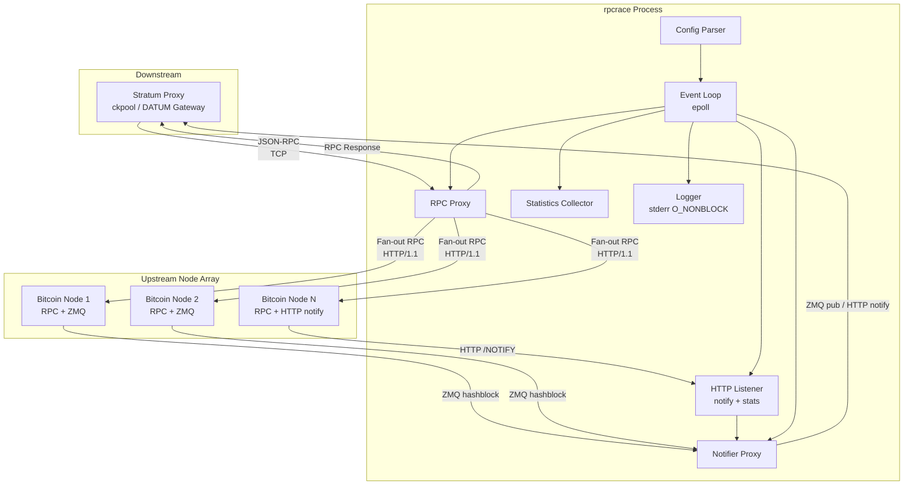
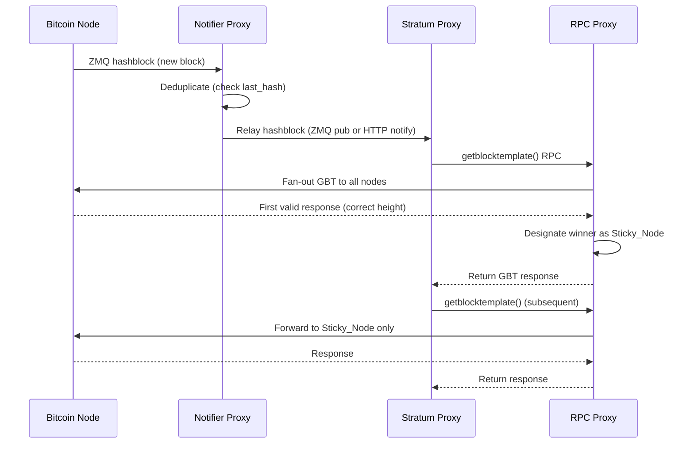
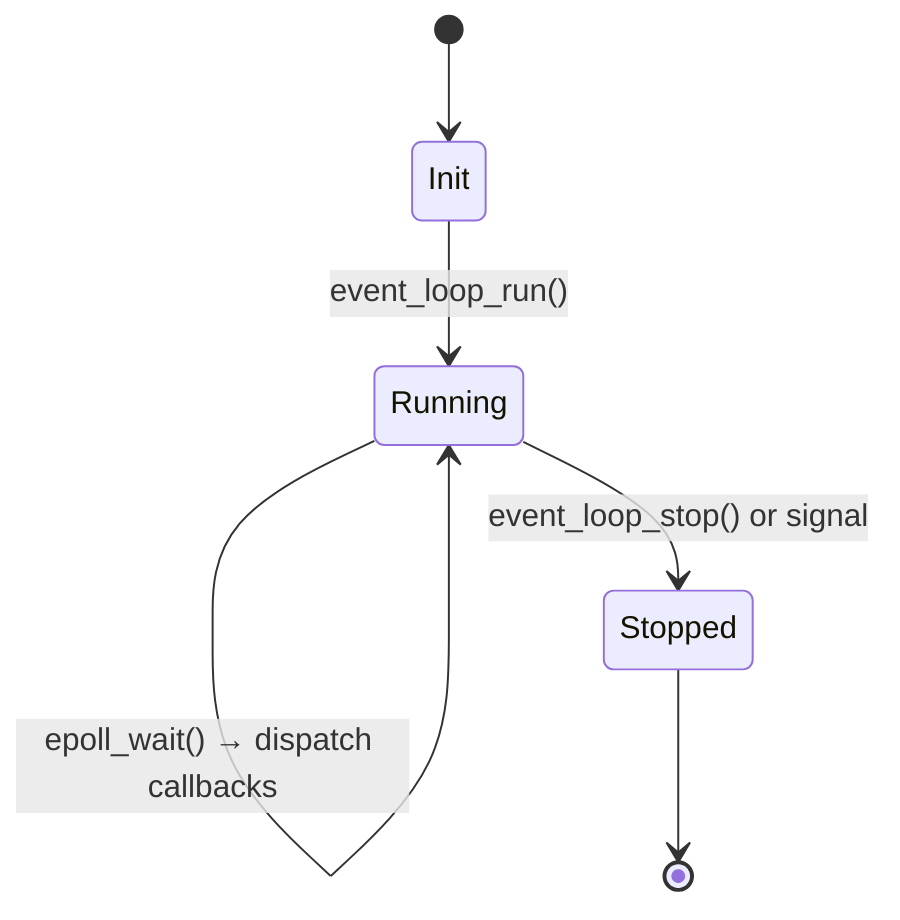
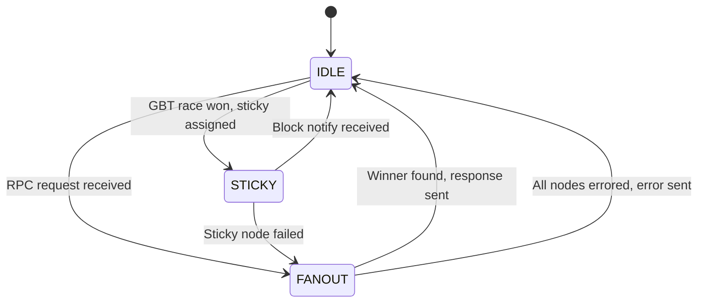
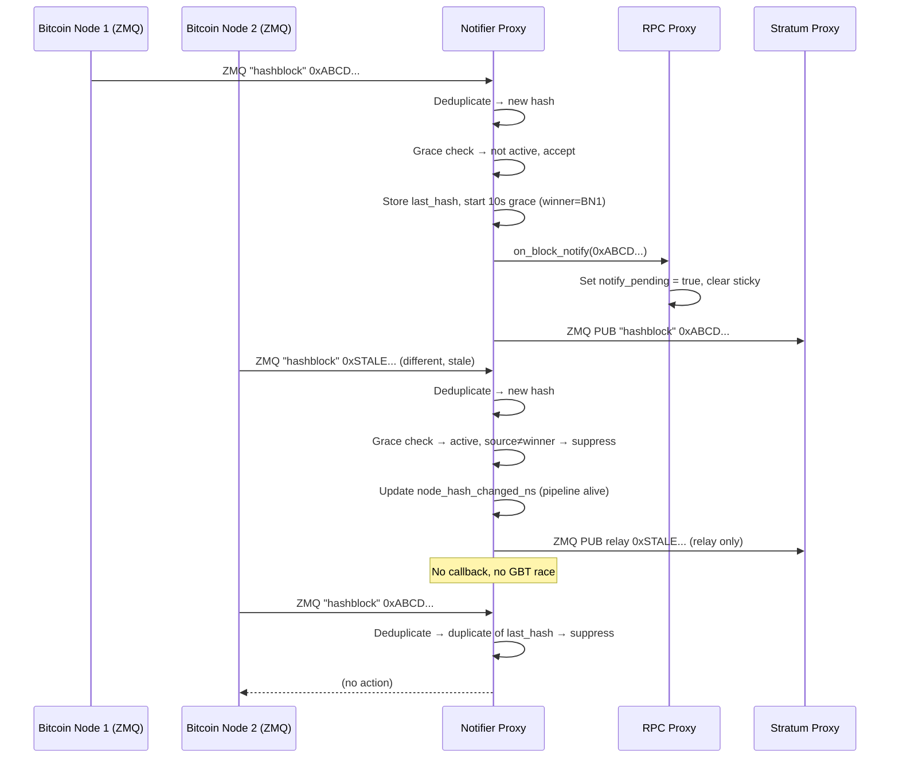
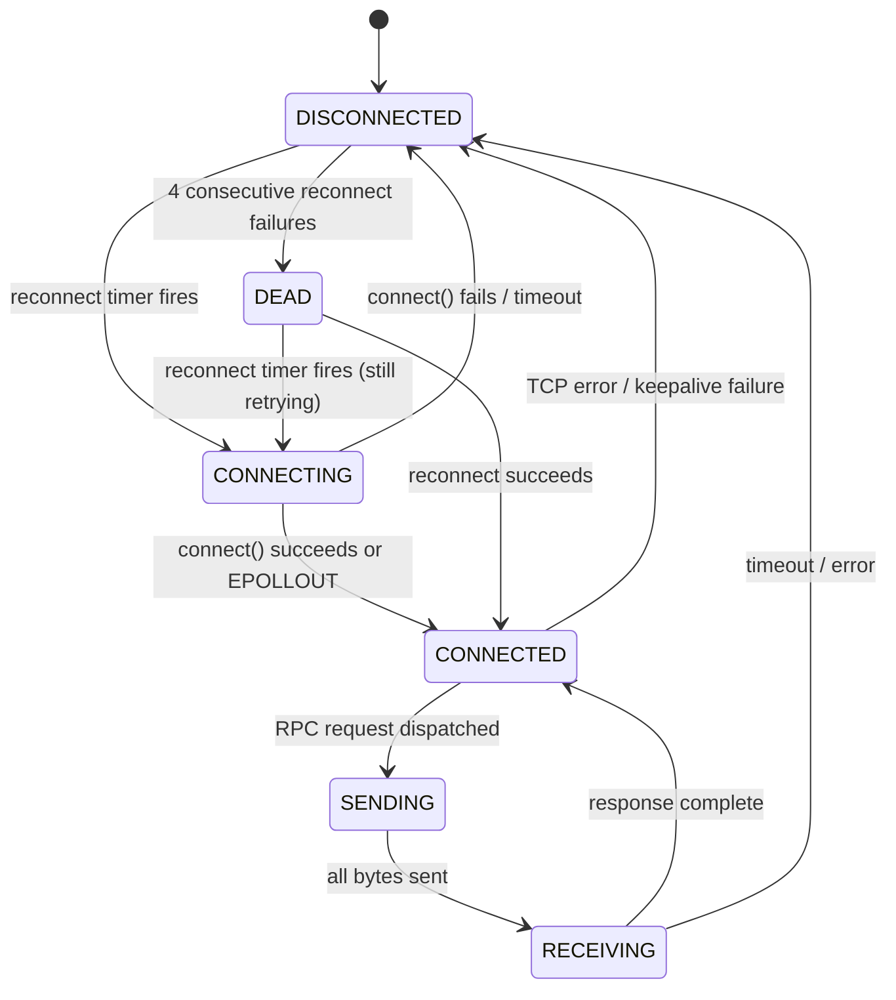

# Design Document: rpcrace

## Overview

rpcrace is a single-binary, single-threaded, event-driven RPC proxy and block notification relay written in C. It sits between one stratum proxy client and multiple upstream Bitcoin nodes, racing time-critical RPC requests across the node array to minimize latency caused by lock contention and variable response times on individual nodes.

The system has two logical subsystems that share a single event loop and HTTP listener:

1. **Notifier Proxy** — Receives block notifications from Bitcoin nodes via ZMQ subscriptions and/or HTTP `blocknotify` callbacks, deduplicates them, and relays the first occurrence to the downstream stratum proxy.
2. **RPC Proxy** — Accepts JSON-RPC requests from the stratum proxy, fans them out to the node array according to method-specific routing rules, and returns the fastest valid response.

### Design Goals

- **Minimal latency**: Single-threaded event loop avoids context switches; epoll-based I/O avoids blocking.
- **Correctness over speed**: submitblock() and sendrawtransaction() are never aborted; all nodes receive the full payload.
- **Resilience**: Automatic reconnection to nodes; graceful handling of partial failures.
- **Simplicity**: No threads, no dynamic plugin system, minimal dependencies. One binary, one config file.
- **Observability**: Microsecond-precision non-blocking logging; JSON statistics endpoint.

## Architecture



### Component Interaction Flow



## Components and Interfaces

### Module Decomposition

| Module | File(s) | Responsibility |
|--------|---------|----------------|
| `main` | `main.c` | Entry point, signal handling, event loop bootstrap, systemd watchdog |
| `config` | `config.c`, `config.h` | JSON config parsing via yyjson, validation, struct population |
| `event_loop` | `event_loop.c`, `event_loop.h` | epoll wrapper, timer management, fd registration |
| `rpc_proxy` | `rpc_proxy.c`, `rpc_proxy.h` | Client connection handling, request parsing, fan-out dispatch, race logic |
| `rpc_conn` | `rpc_conn.c`, `rpc_conn.h` | Upstream HTTP/1.1 connection pool, send/recv buffers, reconnection |
| `notifier` | `notifier.c`, `notifier.h` | ZMQ subscriptions, HTTP notify handler, deduplication, relay |
| `http_server` | `http_server.c`, `http_server.h` | Minimal HTTP/1.1 server for /NOTIFY and /stats endpoints |
| `stats` | `stats.c`, `stats.h` | Per-node metrics collection, JSON serialization |
| `log` | `log.c`, `log.h` | Non-blocking stderr logging with microsecond timestamps |
| `util` | `util.c`, `util.h` | Clock helpers, hex encoding, buffer utilities |

### Interface Contracts

```c
/* event_loop.h */
typedef struct event_loop event_loop_t;
typedef void (*event_cb)(event_loop_t *loop, int fd, uint32_t events, void *data);
typedef void (*timer_cb)(event_loop_t *loop, void *data);

event_loop_t *event_loop_create(void);
int  event_loop_add_fd(event_loop_t *loop, int fd, uint32_t events, event_cb cb, void *data);
int  event_loop_mod_fd(event_loop_t *loop, int fd, uint32_t events);
int  event_loop_del_fd(event_loop_t *loop, int fd);
int  event_loop_add_timer(event_loop_t *loop, uint64_t ms, timer_cb cb, void *data);
void event_loop_run(event_loop_t *loop);
void event_loop_stop(event_loop_t *loop);
void event_loop_destroy(event_loop_t *loop);

/* rpc_proxy.h */
typedef struct rpc_proxy rpc_proxy_t;

rpc_proxy_t *rpc_proxy_create(event_loop_t *loop, config_t *cfg);
void rpc_proxy_destroy(rpc_proxy_t *proxy);
void rpc_proxy_on_block_notify(rpc_proxy_t *proxy, const uint8_t *hash);

/* notifier.h */
typedef struct notifier notifier_t;
typedef void (*notify_cb)(const uint8_t *hash, void *data);

notifier_t *notifier_create(event_loop_t *loop, config_t *cfg, notify_cb cb, void *data);
void notifier_destroy(notifier_t *n);

/* config.h */
typedef struct config config_t;

config_t *config_load(const char *path);
void config_destroy(config_t *cfg);

/* log.h */
void log_init(int verbosity);
void log_msg(int level, const char *fmt, ...) __attribute__((format(printf, 2, 3)));

#define LOG_CRIT  0
#define LOG_WARN  1
#define LOG_INFO  2
#define LOG_DEBUG 3
```

## Data Models

### Configuration Structures

```c
#define MAX_NODES 8
#define MAX_PATH_LEN 256
#define SOCKET_BUF_SIZE 4194304  /* 4 MB socket send/recv buffer */

typedef struct {
    char host[256];           /* e.g. "192.168.1.10" */
    uint16_t rpc_port;        /* e.g. 8332 */
    uint16_t zmq_port;        /* ZMQ hashblock port, 0 if not configured */
    char label[64];           /* human-readable label for logging */
} node_config_t;

typedef struct {
    /* Node array */
    node_config_t nodes[MAX_NODES];
    int node_count;

    /* RPC listener */
    char rpc_server_bind[64];     /* e.g. "127.0.0.1" */
    uint16_t rpc_server_port;     /* e.g. 8332 */

    /* HTTP listener (notify + stats) */
    char http_server_bind[64];    /* e.g. "0.0.0.0" */
    uint16_t http_server_port;    /* e.g. 7152 */

    /* Downstream notification relay */
    char zmq_server_bind[64];     /* ZMQ PUB bind address, e.g. "0.0.0.0" */
    uint16_t zmq_server_port;     /* ZMQ PUB port, 0 = disabled */
    char notify_http_url[512];    /* HTTP GET URL template for stratum proxy, %s = hash */

    /* Timeouts and tuning */
    uint32_t rpc_timeout_ms;       /* global RPC timeout in milliseconds */
    uint32_t reconnect_delay_ms;   /* delay before reconnection attempt */
    uint32_t stall_threshold_ms;   /* event loop stall detection threshold */

    /* Logging */
    int log_verbosity;             /* LOG_CRIT..LOG_DEBUG */
} config_t;
```

### Runtime State Structures

```c
typedef enum {
    CONN_DISCONNECTED,
    CONN_CONNECTING,
    CONN_CONNECTED,
    CONN_SENDING,
    CONN_RECEIVING,
    CONN_DEAD           /* unreachable after 4+ consecutive reconnect failures */
} conn_state_t;

typedef struct {
    int fd;
    conn_state_t state;
    node_config_t *config;

    /* Send buffer (points into shared request buffer, zero-copy; NULL when idle) */
    const uint8_t *send_buf;
    size_t send_len;
    size_t send_offset;

    /* Receive buffer (pre-allocated at startup, SOCKET_BUF_SIZE capacity) */
    uint8_t *recv_buf;
    size_t recv_len;
    size_t recv_cap;

    /* Timing */
    uint64_t request_start_ns;  /* CLOCK_MONOTONIC nanoseconds */

    /* Reconnection */
    int reconnect_attempts;
    uint64_t next_reconnect_ns;
} upstream_conn_t;

typedef enum {
    RACE_IDLE,
    RACE_FANOUT,
    RACE_STICKY
} race_state_t;

/* Note: rpc_proxy_t is defined as an opaque type in rpc_proxy.h
   (typedef struct rpc_proxy rpc_proxy_t). The full definition below
   is internal to rpc_proxy.c. */

struct rpc_proxy {
    /* Race state */
    race_state_t state;
    int sticky_node_idx;        /* index into node array, -1 if none */
    int64_t last_block_height;  /* last known block height */
    bool notify_pending;        /* true after notify, cleared after first GBT race */

    /* Active race tracking */
    int responses_pending;      /* count of nodes still in-flight */
    int winner_idx;             /* index of winning node, -1 if none yet */
    bool all_must_complete;     /* true for submitblock/sendrawtransaction */

    /* Client connection */
    int client_fd;
    uint8_t *client_recv_buf;   /* pre-allocated at startup, SOCKET_BUF_SIZE capacity */
    size_t client_recv_len;
    size_t client_recv_cap;
    bool client_connected;

    /* Upstream connections */
    upstream_conn_t upstreams[MAX_NODES];
    int upstream_count;
};
```

### Statistics Structures

```c
typedef struct {
    uint64_t gbt_response_time_us;  /* last GBT response time in microseconds */
    uint64_t gbt_total_time_us;     /* cumulative GBT response time */
    uint32_t gbt_count;             /* number of GBT responses */
    uint32_t gbt_wins;              /* number of times this node won the GBT race */
    uint32_t gbt_last_tx_count;     /* transaction count from last GBT */
    uint64_t last_response_time_us; /* last response time for any RPC */
    uint64_t gbt_last_since_notify_us; /* time from notify to this node's last GBT response */
    uint32_t notify_wins;           /* number of times this node was first to notify */
} node_stats_t;

typedef struct {
    node_stats_t per_node[MAX_NODES];
    int node_count;

    /* Global timing */
    uint64_t last_notify_to_gbt_us; /* time from notify to winning GBT response */
    uint64_t last_notify_time_ns;   /* CLOCK_MONOTONIC timestamp of last notify */
    uint32_t total_races;           /* total number of GBT races */
    uint32_t total_requests;        /* total RPC requests proxied */
} stats_t;
```

### Notifier State

```c
typedef struct {
    /* ZMQ subscriber sockets (one per node with ZMQ configured) */
    void *zmq_ctx;
    void *zmq_subs[MAX_NODES];
    int zmq_sub_count;
    int zmq_fds[MAX_NODES];         /* file descriptors for epoll integration */

    /* ZMQ publisher socket (for downstream relay) */
    void *zmq_pub;

    /* ZMQ PUB sequence counter (monotonically increasing, 4-byte LE) */
    uint32_t zmq_pub_seq;

    /* Deduplication — stored as 32 bytes in display/RPC byte order (as received from ZMQ) */
    uint8_t last_hash[32];
    bool has_last_hash;

    /* Downstream relay config */
    int notify_http_fd;             /* non-blocking TCP socket for HTTP notify */
    int notify_http_state;          /* connection state for HTTP notify socket */

    /* Silence detection: per-node tracking */
    int node_map[MAX_NODES];        /* zmq_sub index → config node index */
    uint8_t node_last_hash[MAX_NODES][32]; /* per-node: last reported hash */
    bool node_has_hash[MAX_NODES];  /* per-node: has reported at least one hash */
    uint64_t node_hash_changed_ns[MAX_NODES]; /* per-node: last hash change time */
    uint64_t first_notify_ns;       /* timestamp of first notify for current block */
    bool silence_warned[MAX_NODES]; /* already warned for current block event? */
    int total_notify_sources;       /* number of nodes with ZMQ or HTTP notify */

    /* Grace period: suppress notifies from non-winning nodes for 10s */
    bool grace_active;
    uint64_t grace_start_ns;
    int grace_winner_node_idx;      /* config node index of winning notify node */

    /* Callback */
    notify_cb on_notify;
    void *cb_data;

    /* Reference to config and optional pointers */
    config_t *cfg;
    stats_t *stats;
    struct rpc_proxy *proxy;        /* for IBD state checks */
} notifier_t;
```


## Detailed Design

### Event Loop Design

The event loop is the central scheduler. It wraps Linux `epoll` (preferred for simplicity and broad kernel support on Ubuntu 24.04 / Debian 13). The design is single-threaded — all I/O, timers, and state transitions happen in one thread to avoid synchronization overhead.



**Timer Implementation**: Timers are implemented using `timerfd_create()` which integrates naturally with epoll. Each timer gets its own fd registered with the event loop. This avoids maintaining a sorted timer list and leverages kernel-level timer management.

**Stall Detection**: A recurring timer fires every `stall_threshold_ms / 2`. Each iteration records a monotonic timestamp. If the delta between consecutive firings exceeds `stall_threshold_ms`, the process logs a critical error and calls `exit(1)` to allow the supervisor to restart it.

**Systemd Watchdog**: A separate timer fires at `WatchdogSec / 2` intervals and writes `WATCHDOG=1` to the `$NOTIFY_SOCKET` Unix datagram socket (non-blocking).

### RPC Race Logic



**Method Routing Table**:

| Method | Strategy | Abort on first success? | Notes |
|--------|----------|------------------------|-------|
| `getblocktemplate` (first after notify) | Fan-out race | Yes (discard late) | Winner becomes sticky |
| `getblocktemplate` (subsequent) | Sticky only | N/A | Falls back to race if sticky fails |
| `submitblock` | Broadcast all | No — all must complete | First success returned |
| `sendrawtransaction` | Broadcast all | No — all must complete | First success returned |
| `preciousblock` | Sticky only | N/A | Error if no sticky |
| `validateaddress` | Fan-out race | Yes (discard late) | Known method, no special handling |
| `decoderawtransaction` | Fan-out race | Yes (discard late) | Known method, no special handling |
| All others | Fan-out race | Yes (discard late) | Logged as unexpected |

**GBT Height Validation**: When racing getblocktemplate() after a notify:
1. Parse the `"height"` field from each response using yyjson.
2. Compare against `last_block_height + 1` (the expected next height).
3. First response matching the expected height wins.
4. If no response matches, select the response with the highest height (last one received at that height wins).
5. Update `last_block_height` only if the response height is strictly greater than the current value.

**Zero-Copy Request Forwarding**: The incoming HTTP request from the stratum proxy (headers + JSON-RPC body) is read into a single buffer and treated as entirely read-only. The complete HTTP request is forwarded verbatim to each upstream node — no header construction, no body copy, no per-node modification. Each upstream connection's send pointer references the same shared buffer. Since all nodes share the same auth (pass-through) and the request is identical, there is nothing to modify. After the race completes and the response is sent to the client, all upstream send pointers are set to NULL.

**Single Request In-Flight**: Only one RPC request from the client may be in progress at a time. If a second HTTP request arrives from the stratum proxy while a race or sticky request is still in-flight, the proxy logs an error and drops the new request without processing. This matches the behavior of ckpool and DATUM Gateway, which send requests sequentially (no HTTP pipelining).

### Block Notification Flow



**ZMQ Integration with epoll**: libzmq sockets expose a file descriptor via `zmq_getsockopt(ZMQ_FD)`. This fd is registered with epoll for `EPOLLIN`. When epoll signals readability, the callback checks `zmq_getsockopt(ZMQ_EVENTS)` for `ZMQ_POLLIN` and then calls `zmq_recv()` in a loop until no more messages are available (edge-triggered style).

**ZMQ hashblock byte order**: Bitcoin Core publishes the block hash on the ZMQ "hashblock" topic as 32 raw bytes in **reversed byte order** (the same display/RPC order used by block explorers and the JSON-RPC interface). This is the same format as the hex string in the HTTP `/NOTIFY/<hex>` endpoint. The `last_hash` field stores the hash in this format directly — no byte-reversal is needed for deduplication between ZMQ and HTTP sources. The downstream ZMQ PUB relay publishes in the same format (32 bytes, display order, topic "hashblock", followed by a 4-byte little-endian sequence number) to match Bitcoin Core's ZMQ protocol. Hex-encoding for log messages and HTTP notify URL substitution is a straightforward byte-to-hex conversion with no reversal. Reference: https://github.com/bitcoin/bitcoin/blob/master/doc/zmq.md

**ZMQ Reconnection**: libzmq handles reconnection internally for SUB sockets. The notifier does not need to manually reconnect — libzmq's built-in reconnect handles TCP drops and node restarts.

**Notification Silence Detection**: The notifier monitors each ZMQ-configured node's notification pipeline for liveness. Per-node state tracks the last block hash each node reported (`node_last_hash[i]`) and the monotonic timestamp when that hash last changed (`node_hash_changed_ns[i]`). A recurring 10-second timer compares each node's `node_hash_changed_ns` against `first_notify_ns` (the timestamp of the current block event). If 60 seconds elapse and a node's hash has not changed since before the block event, a warning is logged. Nodes that report any hash — even stale hashes suppressed by the grace period — have their `node_hash_changed_ns` updated and are considered alive. Nodes in IBD are excluded. Each node is warned at most once per block event (`silence_warned[i]` flag, reset when a new block is accepted). The timer is only active when 2+ notification sources are configured.

**Notify Grace Period**: After accepting a new block notification (invoking the callback), the notifier enters a 10-second grace period. During this window, notifications from nodes other than the "winning notify node" (the node that triggered the accepted notification) carrying a different hash are suppressed — logged as suppressed, relayed downstream via ZMQ PUB and HTTP, but the proxy callback is not invoked and no GBT race is triggered. This prevents stale/late notifications from remote nodes from causing unnecessary duplicate races. The exception: if the winning notify node itself reports a new different hash during the grace period, it is treated as a legitimate fast block — the notification is accepted, the callback fires, and the grace period resets. Global state (`last_hash`, `first_notify_ns`) is only updated for accepted notifications, ensuring suppressed hashes do not corrupt dedup or silence detection state.

**Downstream Relay**:
- **ZMQ PUB**: If configured, a ZMQ PUB socket is bound and the block hash is published as a multipart message matching Bitcoin Core's format: topic "hashblock" (9 bytes), body (32-byte hash in display order), and a 4-byte little-endian sequence number. The notifier maintains its own monotonically increasing sequence counter, incremented on each publish.
- **HTTP notify**: If a `notify_http_url` is configured, the notifier issues a non-blocking HTTP GET to the URL. If the URL contains `%s`, it is replaced with the 64-character hex block hash; otherwise the URL is used as-is. The connection is managed within the event loop (non-blocking connect, write request, read and discard response). A persistent connection is maintained where possible; if the remote closes it, a fresh connection is established on the next notification. If the write would block (remote is slow to accept), the notification is dropped and a warning is logged — no buffering or retry. Failures do not block the event loop or suppress other relay methods.

### Connection Management and Reconnection

**Upstream Connection Lifecycle**:



**Reconnection Strategy**: Exponential backoff starting at `reconnect_delay_ms`, doubling up to a cap of 30 seconds. Reset to base delay on successful connection. After 4 consecutive reconnect failures (~7 seconds elapsed), the node transitions to `CONN_DEAD`. Reconnection attempts continue from the DEAD state — a successful reconnect returns the node to CONNECTED.

**Client Connection Drop on All-Dead**: If all configured upstream nodes are in the `CONN_DEAD` state, the proxy refuses new client connections and drops any active client connection. This signals the stratum proxy to fail over to an alternative RPC endpoint. The client is not dropped for transient disconnections (e.g. Bitcoin Core's 30-second idle timeout) because the reconnect succeeds within 1-2 seconds, well before the 4-failure threshold.

**Socket Configuration** (applied at connection time):
```c
int flag = 1;
setsockopt(fd, IPPROTO_TCP, TCP_NODELAY, &flag, sizeof(flag));
setsockopt(fd, SOL_SOCKET, SO_KEEPALIVE, &flag, sizeof(flag));

int bufsize = SOCKET_BUF_SIZE;
setsockopt(fd, SOL_SOCKET, SO_SNDBUF, &bufsize, sizeof(bufsize));
setsockopt(fd, SOL_SOCKET, SO_RCVBUF, &bufsize, sizeof(bufsize));

/* Verify actual buffer size */
int actual = 0;
socklen_t len = sizeof(actual);
getsockopt(fd, SOL_SOCKET, SO_SNDBUF, &actual, &len);
if (actual < bufsize)
    log_msg(LOG_WARN, "SO_SNDBUF: requested %d, got %d", bufsize, actual);
```

**HTTP/1.1 Persistent Connections**: Upstream connections use `Connection: keep-alive`. After each response is fully received (determined by `Content-Length` header), the connection returns to `CONNECTED` state ready for the next request. If the server sends `Connection: close`, the connection is torn down and reconnection is scheduled.

### Configuration Parsing

The configuration file is parsed at startup using yyjson (immutable document mode for safety and speed).

**Example `rpcrace.conf`**:
```json
{
    "nodes": [
        {
            "label": "local-knots",
            "host": "127.0.0.1",
            "rpc_port": 8332,
            "zmq_port": 38332
        },
        {
            "label": "remote-core",
            "host": "10.0.1.50",
            "rpc_port": 8332,
            "zmq_port": 28332
        },
        {
            "label": "cloud-node",
            "host": "203.0.113.10",
            "rpc_port": 8332
        }
    ],
    "rpc_server_bind": "127.0.0.1",
    "rpc_server_port": 8332,
    "http_server_bind": "0.0.0.0",
    "http_server_port": 37152,
    "zmq_server_bind": "0.0.0.0",
    "zmq_server_port": 28332,
    "notify_http_url": "http://127.0.0.1:7152/NOTIFY/%s",
    "rpc_timeout_ms": 30000,
    "reconnect_delay_ms": 1000,
    "stall_threshold_ms": 60000,
    "log_verbosity": 2
}
```

**Validation Rules**:
- At least one node must be configured.
- `rpc_server_port` and `http_server_port` must be non-zero.
- `rpc_timeout_ms` must be > 0.
- At least one downstream notification method (ZMQ or HTTP URL) should be configured (warning if neither).
- Node labels must be unique (used in log messages).

### Statistics Collection

Statistics are collected inline during normal request processing (no separate collection thread). The `stats_t` structure is updated atomically (single-threaded, so no locks needed).

**JSON Statistics Endpoint** (`GET /stats`):

```json
{
    "uptime_seconds": 86400,
    "total_requests": 15234,
    "total_gbt_races": 1440,
    "last_notify_to_gbt_us": 45230,
    "nodes": [
        {
            "label": "local-knots",
            "race_gbt": {
                "avg_us": 52000,
                "last_us": 48000,
                "since_notify_us": 45230,
                "wins": 890,
                "count": 1440,
                "last_tx_count": 4521
            },
            "notify_wins": 780,
            "state": "connected"
        },
        {
            "label": "remote-core",
            "race_gbt": {
                "avg_us": 78000,
                "last_us": 65000,
                "since_notify_us": 91000,
                "wins": 550,
                "count": 1440,
                "last_tx_count": 4519
            },
            "notify_wins": 660,
            "state": "dead"
        }
    ]
}
```

The statistics JSON is generated on-demand when the endpoint is hit, using yyjson's mutable document API. No periodic file writes — the HTTP endpoint is the sole interface.

### Logging Subsystem

**Design Decisions**:
- All output goes to stderr (works in both systemd and Docker environments).
- stderr is set to `O_NONBLOCK` at startup via `fcntl()`.
- If `write()` returns `EAGAIN`/`EWOULDBLOCK`, the message is silently discarded.
- No internal buffering — each log call attempts one `write()` syscall with a pre-formatted message.

**Log Message Format**:
```
2025-01-15T14:30:05.123456Z [INFO] [local-knots] GBT race won: height=878901 txns=4521 elapsed_us=48230
2025-01-15T14:30:05.123500Z [WARN] [remote-core] Slow response: elapsed=5.2s method=getblocktemplate
```

Format: `<ISO8601 with microseconds>Z [<LEVEL>] [<source>] <message>`

**Timestamp Generation**: The wall-clock timestamp (`CLOCK_REALTIME`) is cached once at the top of each `epoll_wait()` dispatch iteration and reused for all log messages within that batch. This avoids repeated clock reads on the hot path while maintaining meaningful microsecond ordering (events within one dispatch are causally ordered). `CLOCK_MONOTONIC` is used for all internal elapsed time calculations.

**Verbosity Levels**:
- `LOG_CRIT` (0): Process-fatal errors, entire node array unreachable
- `LOG_WARN` (1): Slow responses (>5s), buffer size warnings, unexpected RPC methods, connection failures
- `LOG_INFO` (2): Race winners, notify events, connection state changes, RPC method names
- `LOG_DEBUG` (3): Per-node response details, buffer sizes, timer firings

### Build System Design

**Directory Structure**:
```
rpcrace/
├── Makefile
├── configure
├── src/
│   ├── main.c
│   ├── config.c / config.h
│   ├── event_loop.c / event_loop.h
│   ├── rpc_proxy.c / rpc_proxy.h
│   ├── rpc_conn.c / rpc_conn.h
│   ├── notifier.c / notifier.h
│   ├── http_server.c / http_server.h
│   ├── stats.c / stats.h
│   ├── log.c / log.h
│   └── util.c / util.h
├── include/
│   ├── uthash.h
│   └── yyjson.h / yyjson.c  (vendored single-file)
├── tests/
│   ├── test_config.c
│   ├── test_rpc_routing.c
│   ├── test_notifier.c
│   ├── test_stats.c
│   └── test_log.c
├── deploy/
│   ├── rpcrace.service
│   ├── Dockerfile
│   └── rpcrace.conf.example
├── LICENSE
└── README.md
```

**Makefile Targets**:
- `all` (default): Build the `rpcrace` binary
- `test`: Build and run unit tests
- `clean`: Remove build artifacts
- `install`: Install binary to `$(PREFIX)/bin`

**Compiler Flags**:
```makefile
CC = gcc
CFLAGS = -std=c11 -Wall -Wextra -Werror -Wpedantic -Wshadow \
         -Wstrict-prototypes -Wmissing-prototypes \
         -O2 -march=native -flto -D_GNU_SOURCE
LDFLAGS = -flto
LIBS = -lzmq -lpthread
```

**Configure Script**: A POSIX shell script that:
1. Checks for `pkg-config`
2. Runs `pkg-config --cflags --libs libzmq` to get ZMQ paths
3. Checks for required headers (`zmq.h`, `sys/epoll.h`)
4. Writes `config.mk` with detected paths and flags
5. Verifies target architecture (x86_64 or aarch64)


## Correctness Properties

*A property is a characteristic or behavior that should hold true across all valid executions of a system — essentially, a formal statement about what the system should do. Properties serve as the bridge between human-readable specifications and machine-verifiable correctness guarantees.*

### Property 1: Block Hash Deduplication

*For any* sequence of block notifications (arriving via ZMQ or HTTP in any interleaving), the notifier shall relay exactly one notification per unique block hash, and all subsequent notifications with the same hash shall be suppressed.

**Validates: Requirements 1.3, 2.2, 3.5**

### Property 2: RPC Method Routing Classification

*For any* RPC method name string, the routing decision shall be: `getblocktemplate` → race-then-sticky, `submitblock` → broadcast-all (no abort), `sendrawtransaction` → broadcast-all (no abort), `preciousblock` → sticky-only, all others → fan-out race. Method names not in the expected list shall additionally be logged as unexpected but still use fan-out.

**Validates: Requirements 4.1, 4.5, 5.1, 6.1, 7.1, 8.1**

### Property 3: Race Winner Selection

*For any* ordered sequence of RPC responses from the node array where at least one response is a non-error (neither HTTP error nor RPC error), the first non-error response in arrival order shall be selected as the winner and returned to the stratum proxy.

**Validates: Requirements 4.3, 6.3, 7.3**

### Property 4: All-Error Fallback

*For any* ordered sequence of RPC responses from the node array where every response is an error (HTTP or RPC), the last error received shall be returned to the stratum proxy.

**Validates: Requirements 4.4, 5.6, 6.4, 7.4**

### Property 5: GBT Height Match Selection

*For any* set of valid getblocktemplate() responses received during a race after a block notification, if at least one response has a height equal to `last_block_height + 1`, the first such response in arrival order shall win and its node shall become the sticky node.

**Validates: Requirements 5.2**

### Property 6: GBT Height Fallback Selection

*For any* set of valid getblocktemplate() responses received during a race where no response matches `last_block_height + 1`, the response with the highest height shall win (last received if tied), and its node shall become the sticky node.

**Validates: Requirements 5.3**

### Property 7: Block Height Monotonicity

*For any* sequence of successful getblocktemplate() responses processed over time, the recorded `last_block_height` value shall be monotonically non-decreasing — it is updated only when a response height is strictly greater than the current recorded value.

**Validates: Requirements 5.5**

### Property 8: HTTP Notify Path Parsing

*For any* valid 32-byte block hash encoded as a 64-character hexadecimal string, an HTTP GET request to `/NOTIFY/<hex_hash>` shall correctly extract and process the block hash bytes.

**Validates: Requirements 2.1**

### Property 9: Invalid Block Hash Rejection

*For any* string that is not a valid 64-character hexadecimal representation of a 32-byte hash (wrong length, non-hex characters, empty string), an HTTP notify request containing that string shall be rejected with HTTP 400.

**Validates: Requirements 2.4**

### Property 10: HTTP Notify URL Substitution

*For any* HTTP notify URL template string and any valid block hash hex string: if the URL contains `%s`, the HTTP GET request shall target the URL with `%s` replaced by the block hash; if the URL does not contain `%s`, the HTTP GET request shall target the URL unchanged.

**Validates: Requirements 3.3, 3.4**

### Property 11: Log Message Format

*For any* log message at any verbosity level with any source identifier, the formatted output shall contain: (1) a valid ISO 8601 timestamp with microsecond precision, (2) the log level tag, and (3) the source identifier.

**Validates: Requirements 9.3, 9.4**

### Property 12: Slow Response Threshold Warning

*For any* RPC response with an elapsed time measurement, a warning shall be logged if and only if the elapsed time exceeds 5 seconds. The warning shall identify the node and include the elapsed time.

**Validates: Requirements 9.9**

### Property 13: Configuration Round-Trip

*For any* valid configuration (node array with 1–8 nodes each having host, port, and optional ZMQ endpoint; valid bind addresses; positive timeout; valid verbosity level), serializing to JSON and parsing with `config_load()` shall produce an equivalent `config_t` structure.

**Validates: Requirements 11.4, 11.5, 11.6, 11.7, 11.8, 11.9**

### Property 14: Statistics Accumulation

*For any* sequence of (node_index, response_time_us, tx_count) tuples fed to the statistics collector, the per-node `gbt_count` shall equal the number of tuples for that node, `gbt_total_time_us` shall equal the sum of response times for that node, and `gbt_last_tx_count` shall equal the tx_count from the most recent tuple for that node.

**Validates: Requirements 10.1, 10.2, 10.3**

### Property 15: Statistics JSON Serialization

*For any* valid `stats_t` structure, serializing to JSON and deserializing shall produce values matching the original structure's fields (uptime, per-node metrics, global counters).

**Validates: Requirements 10.4**

### Property 16: Auth Header Pass-Through

*For any* HTTP Basic Authentication header value in an incoming stratum proxy request, the upstream request to each Bitcoin node shall contain the identical Authorization header without modification.

**Validates: Requirements 12.7**

### Property 17: Notify Grace Period Suppression

*For any* sequence of block notifications where the first notification from node A is accepted, all subsequent notifications from other nodes carrying a different block hash that arrive within 10 seconds shall be suppressed (not triggering a callback) but still relayed downstream. A notification from node A with a different hash during the grace period shall be accepted and reset the grace period.

**Validates: Requirements 1.6, 1.7, 1.8**

### Property 18: Notification Pipeline Liveness

*For any* ZMQ-configured node that reports at least one hash (whether accepted, deduplicated, or grace-suppressed) that differs from its own previously reported hash since the most recent accepted block event, that node shall not trigger a silence warning. Only nodes whose last reported hash has not changed since before the block event shall be warned after 60 seconds.

**Validates: Requirements 22.2, 22.3, 22.4**

### Property 19: Initial Connect Logging

*For any* connection pair, the "available" log message shall be emitted exactly once — on the first successful connection of either slot after initialization. Subsequent recovery events (standby swap when active is down) shall emit "recovered" instead.

**Validates: Requirements 23.1, 23.2, 23.3**

## Error Handling

### Error Categories and Responses

| Error Condition | Handling Strategy |
|----------------|-------------------|
| Config file missing/invalid | Exit with descriptive error message (stderr) |
| All nodes unreachable at startup | Start anyway, accept connections, return errors to client, keep reconnecting |
| Single node connection failure | Mark node as disconnected, schedule reconnect, continue with remaining nodes |
| All nodes fail during race | Return last error to client, log critical |
| Sticky node unreachable | For GBT: fall back to race across all nodes. For preciousblock: return error |
| Client disconnect mid-race | Let upstream requests complete, discard responses |
| Truncated upstream response | Treat as error from that node, continue race with others |
| ZMQ subscription failure | Log error, retry via libzmq internal reconnect |
| HTTP notify invalid hash | Return HTTP 400, no further processing |
| Malloc failure | Log critical, exit (let supervisor restart) |
| Write to stderr blocks | Discard message silently (O_NONBLOCK) |
| Event loop stall | Log critical, exit (let supervisor restart) |
| SIGTERM/SIGINT | Clean shutdown: close all fds, free memory, exit 0 |

### Graceful Degradation

The system operates in a degraded mode when nodes are partially available:
- If N of M nodes are reachable, races proceed with the N available nodes.
- If the sticky node becomes unreachable, the next GBT request triggers a full race to select a new sticky.
- If no nodes are reachable, every RPC request immediately returns an error (no queuing).

## Testing Strategy

### Randomized Property Testing

**Approach**: Hand-rolled randomized testing using a seeded PRNG (`srand48`/`lrand48` or equivalent). No external testing library — each test is a standalone C program that exercises a property over many random inputs.

**Test Harness Pattern**:
```c
#include <stdio.h>
#include <stdlib.h>
#include <time.h>

/* Feature: rpcrace, Property N: <property_text> */
int main(int argc, char **argv) {
    long seed = (argc > 1) ? atol(argv[1]) : time(NULL);
    srand48(seed);
    printf("seed: %ld\n", seed);

    for (int trial = 0; trial < 1000; trial++) {
        /* Generate random input */
        /* Exercise the function under test */
        /* Assert the property holds */
        if (!property_holds) {
            fprintf(stderr, "FAIL at trial %d (seed %ld)\n", trial, seed);
            /* Print the failing input for reproduction */
            return 1;
        }
    }
    printf("PASS (1000 trials)\n");
    return 0;
}
```

**Configuration**:
- Minimum 1000 trials per property (fast enough for pure logic tests)
- Each test prints its seed on startup for reproducibility
- Seed can be passed as argv[1] to reproduce a failure
- Each test tagged with: `/* Feature: rpcrace, Property N: <property_text> */`

**Properties to implement as randomized tests**:
- Property 1: Block hash deduplication (generate random hash sequences with duplicates)
- Property 2: Method routing classification (generate random method name strings)
- Property 3: Race winner selection (generate random response sequences with mixed success/error)
- Property 4: All-error fallback (generate all-error response sequences)
- Property 5: GBT height match selection (generate response sets with various heights)
- Property 6: GBT height fallback (generate response sets where none match expected)
- Property 7: Block height monotonicity (generate random height sequences)
- Property 8: HTTP notify path parsing (generate random 32-byte values, hex-encode)
- Property 9: Invalid block hash rejection (generate random invalid strings)
- Property 10: HTTP notify URL substitution (generate random URLs and hashes)
- Property 11: Log message format (generate random messages, levels, sources)
- Property 12: Slow response threshold (generate random elapsed times around 5s boundary)
- Property 13: Configuration round-trip (generate random valid configs)
- Property 14: Statistics accumulation (generate random metric sequences)
- Property 15: Statistics JSON round-trip (generate random stats structures)
- Property 16: Auth header pass-through (generate random auth strings)

### Unit Tests (Example-Based)

- Startup with no reachable nodes (verify listener still accepts)
- SIGTERM clean shutdown
- Single client connection replacement (second client drops first)
- preciousblock with no sticky node (verify error)
- GBT before any notify (verify race behavior)
- Sticky node routing after race win
- Socket buffer size warning when OS returns smaller value

### Integration Tests

- End-to-end: ZMQ notify → GBT race → response to client
- Reconnection after node restart
- Client disconnect mid-race (upstream completes, responses discarded)
- Mid-transfer disconnect treated as error
- All-nodes-down critical log and error response

### Performance Benchmarks

- RPC forwarding latency (loopback, single node): target < 100μs overhead
- Notification relay latency (ZMQ receive to ZMQ publish): target < 50μs
- JSON config parsing time for maximum-size config
- Statistics JSON serialization time
- Log message formatting throughput (messages/second before discard)

