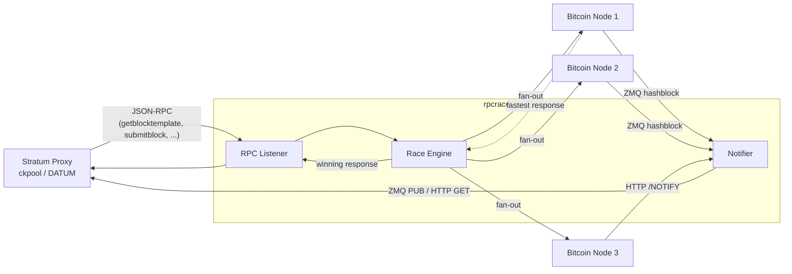

# rpcrace

A high-performance RPC proxy and block notification relay for Bitcoin mining operations. rpcrace sits between your stratum proxy (ckpool, DATUM Gateway, etc.) and multiple upstream Bitcoin nodes, racing time-critical RPC requests across the node array to minimize latency.

## Why

Bitcoin mining is a race. When a new block arrives, your stratum proxy needs a fresh `getblocktemplate()` as fast as possible. Individual Bitcoin nodes suffer from lock contention and variable response times — a single node might take 200ms one time and 2 seconds the next. rpcrace eliminates this variance by fanning out requests to multiple nodes simultaneously and returning the fastest valid response.

Key behaviors:
- **getblocktemplate()** — Raced across all nodes on new block; fastest valid response wins, that node becomes "sticky" for subsequent calls until the next block
- **submitblock()** — Broadcast to all nodes (never aborted) to maximize propagation
- **sendrawtransaction()** — Broadcast to all nodes (never aborted)
- **preciousblock()** — Routed to the current sticky node
- **All other methods** — Raced across all nodes, fastest response wins

Single-threaded, event-driven (epoll), zero-copy request forwarding. One binary, one config file.

## How It Works



Requests from your stratum proxy are fanned out to all configured nodes simultaneously. The first valid response wins and is returned. Block notifications from any node are deduplicated and relayed downstream.

## Building

### Dependencies

Ubuntu/Debian:

```sh
sudo apt install gcc make pkg-config libzmq3-dev
```

No other external libraries are required. yyjson and uthash are vendored in `include/`.

### Compile

```sh
./configure
make
```

The `configure` script uses `pkg-config` to detect libzmq and verifies required headers (`zmq.h`, `sys/epoll.h`). It writes a `config.mk` that the Makefile includes.

### Make targets

| Target | Description |
|--------|-------------|
| `make` | Build the `rpcrace` binary |
| `make test` | Build and run all unit tests |
| `make clean` | Remove build artifacts |
| `make install` | Install binary to `/usr/local/bin` (or run form build directory) |

### Platform support

Linux only (requires epoll). Tested on Ubuntu 24.04, both x86_64 and ARM64.

## Configuration

rpcrace reads a JSON configuration file at startup. By default it looks for `rpcrace.conf` in the current working directory, or you can pass a path as the first argument:

```sh
rpcrace /etc/rpcrace/rpcrace.conf
```

### Example configuration

```json
{
    "nodes": [
        {
            "label": "local-knots",
            "host": "127.0.0.1",
            "rpc_port": 8332,
            "zmq_port": 28332
        },
        {
            "label": "remote-core",
            "host": "10.0.1.50",
            "rpc_port": 8332,
            "zmq_port": 28332
        },
        {
            "label": "cloud-node",
            "host": "203.0.113.10",
            "rpc_port": 8332
        }
    ],

    "rpc_server_bind": "127.0.0.1",
    "rpc_server_port": 8332,

    "http_server_bind": "0.0.0.0",
    "http_server_port": 37152,

    "zmq_server_bind": "0.0.0.0",
    "zmq_server_port": 28332,
    "notify_http_url": "http://127.0.0.1:7152/NOTIFY/%s",

    "rpc_timeout_ms": 30000,
    "reconnect_delay_ms": 1000,
    "stall_threshold_ms": 60000,

    "log_verbosity": 2
}
```

| Field | Description |
|-------|-------------|
| `nodes` | Array of 1–16 upstream Bitcoin nodes to race against |
| `nodes[].label` | Human-readable name (must be unique, used in logs) |
| `nodes[].host` | Bitcoin node IP address or hostname (used for both RPC and ZMQ connections) |
| `nodes[].rpc_port` | Bitcoin node RPC port |
| `nodes[].zmq_port` | ZMQ hashblock port (optional, omit if node uses HTTP blocknotify instead) |
| `rpc_server_bind` | Bind address for incoming JSON-RPC from your stratum proxy |
| `rpc_server_port` | Port for incoming JSON-RPC |
| `http_server_bind` | Bind address for HTTP (must be reachable by Bitcoin nodes for blocknotify) |
| `http_server_port` | Port for `/NOTIFY/<hash>` and `/stats` endpoints |
| `zmq_server_bind` | ZMQ PUB bind address for downstream relay (optional, default `0.0.0.0`) |
| `zmq_server_port` | ZMQ PUB port for downstream relay (optional, 0 or absent to disable) |
| `notify_http_url` | HTTP GET URL template for downstream relay, `%s` is replaced by block hash (optional) |
| `rpc_timeout_ms` | Global timeout for upstream RPC requests (ms) |
| `reconnect_delay_ms` | Base delay before reconnecting to a failed node (doubles up to 30s) |
| `stall_threshold_ms` | Event loop stall detection — process exits if no events for this long (ms) |
| `log_verbosity` | 0=CRIT, 1=WARN, 2=INFO, 3=DEBUG |

### Configuration notes

- At least one node is required.
- Each node should have either a `zmq_port` configured here, or HTTP `blocknotify` configured on the Bitcoin node itself.
- `zmq_server_bind`/`zmq_server_port` and/or `notify_http_url` configure how rpcrace relays block notifications downstream to your stratum proxy. At least one is recommended.
- Node labels must be unique (they appear in log messages).
- The HTTP listener port is shared between the `/NOTIFY/<hash>` endpoint (receives block notifications from Bitcoin nodes) and the `/stats` endpoint (returns JSON performance metrics).

## Bitcoin Node Configuration

Each Bitcoin node in your array needs to notify rpcrace when a new block arrives. Configure one of the following:

### ZMQ (recommended)

In `bitcoin.conf` on each node:

```ini
zmqpubhashblock=tcp://0.0.0.0:28332
```

Then set the corresponding `zmq_port` in `rpcrace.conf` to the port number from that node's ZMQ address. rpcrace subscribes to the "hashblock" topic and receives notifications with minimal latency.

### HTTP blocknotify

For nodes where ZMQ is not available or as a redundant notification path, configure `blocknotify` in `bitcoin.conf`:

```ini
blocknotify=wget -q -O /dev/null http://rpcrace-host:37152/NOTIFY/%s
```

Replace `rpcrace-host` with the IP or hostname where rpcrace is running. The `%s` is replaced by Bitcoin Core with the new block hash. rpcrace's HTTP listener (configured via `http_port`) receives these at `/NOTIFY/<hash>`.

### Deduplication

rpcrace deduplicates notifications automatically. If the same block hash arrives via both ZMQ and HTTP (or from multiple nodes), only the first occurrence triggers a relay to your stratum proxy.

## Deployment

### CLI usage

```sh
# Run with default config (./rpcrace.conf)
rpcrace

# Run with explicit config path
rpcrace /etc/rpcrace/rpcrace.conf
```

Logs go to stderr with microsecond timestamps. In production, let your process supervisor capture stderr.

### systemd

A hardened systemd unit file is provided in `deploy/rpcrace.service`.

Install:

```sh
sudo make install
sudo cp deploy/rpcrace.service /etc/systemd/system/
sudo mkdir -p /etc/rpcrace
sudo cp deploy/rpcrace.conf.example /etc/rpcrace/rpcrace.conf
# Edit /etc/rpcrace/rpcrace.conf for your setup
sudo systemctl daemon-reload
sudo systemctl enable --now rpcrace
```

The service uses `Type=notify` with systemd watchdog integration — rpcrace sends periodic heartbeats and the service is restarted automatically on failure or stall.

Check status:

```sh
sudo systemctl status rpcrace
sudo journalctl -u rpcrace -f
```

### Docker

A Dockerfile is provided in `deploy/Dockerfile`. It uses a multi-stage build (build with gcc + dev libs, run with minimal runtime).

```sh
docker build -f deploy/Dockerfile -t rpcrace .
docker run -d --name rpcrace \
    -v /path/to/rpcrace.conf:/etc/rpcrace/rpcrace.conf:ro \
    -p 8332:8332 \
    -p 37152:37152 \
    rpcrace /etc/rpcrace/rpcrace.conf
```

The Dockerfile includes a `HEALTHCHECK` that polls the `/stats` endpoint to detect event loop hangs. Container orchestrators (Docker Compose, Kubernetes) will restart the container if the health check fails.

## Monitoring

Query the stats endpoint for per-node performance metrics:

```sh
curl http://localhost:37152/stats
```

Returns JSON with per-node GBT response times, race win counts, transaction counts, and global timing metrics.

## License

MIT — see [LICENSE](LICENSE).
