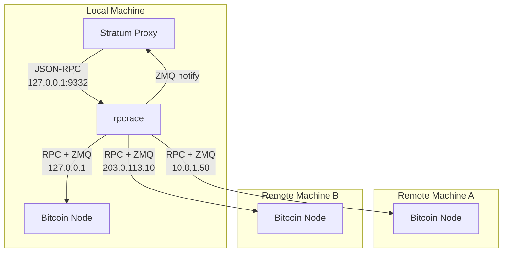
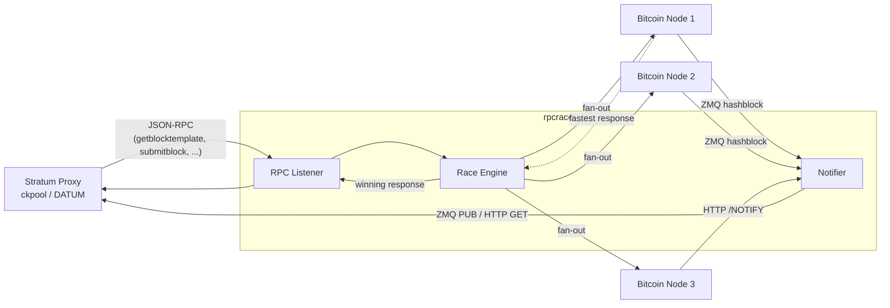

# rpcrace

A high-performance RPC proxy and block notification relay for Bitcoin mining operations. rpcrace sits between a single  stratum proxy (ckpool, DATUM Gateway, etc.) and multiple upstream Bitcoin nodes, racing time-critical RPC requests across the node array to minimize latency.

## Why

Bitcoin mining is a race. When a new block arrives, your stratum proxy needs a fresh `getblocktemplate()` as fast as possible. Individual Bitcoin nodes suffer from lock contention and variable response times — a single node might take 200ms one time and 2 seconds the next. rpcrace eliminates this variance by fanning out requests to multiple nodes simultaneously and returning the fastest valid response.

Key behaviors:
- **getblocktemplate()** — Raced across all nodes after any node notifies of a new block; fastest valid response wins, that node becomes "sticky" for subsequent calls until the next block
- **submitblock()** — Broadcast to all nodes (never aborted) to maximize propagation
- **sendrawtransaction()** — Broadcast to all nodes (never aborted)
- **preciousblock()** — Routed to the current sticky node
- **All other methods** — Raced across all nodes, fastest response wins

Single-threaded, event-driven (epoll), zero-copy request forwarding. One binary, one config file.

## Typical Deployment

The most common setup runs a Bitcoin node, rpcrace, and your stratum proxy together on a single machine, with additional remote Bitcoin nodes for redundancy and latency reduction.



In this layout:
- The local Bitcoin node has the lowest latency (loopback) and will typically win the GBT race, becoming the sticky node.
- Remote nodes provide redundancy — if the local node stalls under lock contention, a remote node's response arrives instead.
- `submitblock()` and `sendrawtransaction()` are broadcast to all nodes regardless of which won the race, maximizing propagation.
- All communication between the stratum proxy and rpcrace stays on localhost. Only the RPC and ZMQ connections to remote nodes cross the network.
- HTTP notifications from the Bitcoin Nodes to rpcrace are also supported.

## Architecture



## Building

### Dependencies

Ubuntu/Debian:

```sh
sudo apt install gcc make pkg-config libzmq3-dev
```

Amazon Linux:

```sh
sudo dnf install gcc make pkg-config zeromq-devel
```

No other external libraries are required. yyjson and uthash are vendored in `include/`.

### Compile

```sh
./configure
make
```

The `configure` script uses `pkg-config` to detect libzmq and verifies required headers (`zmq.h`, `sys/epoll.h`). It writes a `config.mk` that the Makefile includes.

### Make targets

| Target | Description |
|--------|-------------|
| `make` | Build the `rpcrace` binary |
| `make test` | Build and run all unit tests |
| `make clean` | Remove build artifacts |
| `make install` | Install binary to `/usr/local/bin` (or run form build directory) |

### Platform support

Linux only (requires epoll). Tested on Ubuntu 24.04, both x86_64 and ARM64.

## Configuration

rpcrace reads a JSON configuration file at startup. By default it looks for `rpcrace.conf` in the current working directory, or you can pass a path as the first argument:

> **Quick start:** If you're using ckpool or DATUM Gateway and just want to get running, skip to [ckpool Configuration](#ckpool-configuration) or [DATUM Gateway Configuration](#datum-gateway-configuration) below for ready-to-use examples.

```sh
rpcrace /etc/rpcrace/rpcrace.conf
```

### Example configuration

```json
{
    "nodes": [
        {
            "label": "local-node",
            "host": "127.0.0.1",
            "rpc_port": 8332,
            "zmq_port": 8331
        },
        {
            "label": "remote-node",
            "host": "10.0.1.50",
            "rpc_port": 8332,
            "zmq_port": 8331
        },
        {
            "label": "cloud-node",
            "host": "203.0.113.10",
            "rpc_port": 8332
        }
    ],

    "rpc_server_bind": "127.0.0.1",
    "rpc_server_port": 9332,

    "http_server_bind": "0.0.0.0",
    "http_server_port": 9333,

    "zmq_server_bind": "0.0.0.0",
    "zmq_server_port": 9331,
    "notify_http_url": "http://127.0.0.1:7152/NOTIFY/%s",

    "rpc_timeout_ms": 30000,
    "reconnect_delay_ms": 1000,
    "stall_threshold_ms": 60000,

    "log_verbosity": 2
}
```

| Field | Description |
|-------|-------------|
| `nodes` | Array of 1–16 upstream Bitcoin nodes to race against |
| `nodes[].label` | Human-readable name (must be unique, used in logs) |
| `nodes[].host` | Bitcoin node IP address or hostname (used for both RPC and ZMQ connections) |
| `nodes[].rpc_port` | Bitcoin node RPC port |
| `nodes[].zmq_port` | ZMQ hashblock port (optional, omit if node uses HTTP blocknotify instead) |
| `rpc_server_bind` | Bind address for incoming JSON-RPC from your stratum proxy |
| `rpc_server_port` | Port for incoming JSON-RPC |
| `http_server_bind` | Bind address for HTTP (must be reachable by Bitcoin nodes for blocknotify) |
| `http_server_port` | Port for `/NOTIFY/<hash>` and `/stats` endpoints |
| `zmq_server_bind` | ZMQ PUB bind address for downstream relay (optional, default `0.0.0.0`) |
| `zmq_server_port` | ZMQ PUB port for downstream relay (optional, 0 or absent to disable) |
| `notify_http_url` | HTTP GET URL template for downstream relay, `%s` is replaced by block hash (optional) |
| `rpc_timeout_ms` | Global timeout for upstream RPC requests (ms) |
| `reconnect_delay_ms` | Base delay before reconnecting to a failed node (doubles up to 30s) |
| `stall_threshold_ms` | Event loop stall detection — process exits if no events for this long (ms) |
| `log_verbosity` | 0=CRIT, 1=WARN, 2=INFO, 3=DEBUG |

### RPC authentication

rpcrace does not store or verify RPC credentials. It passes the `Authorization` header from the stratum proxy through to the upstream Bitcoin nodes unchanged. This means:

- The same `rpcuser` and `rpcpassword` must be configured identically on all Bitcoin nodes and in your stratum proxy.
- rpcrace itself has no authentication settings — it is transparent.
- Because rpcrace does not authenticate incoming connections, bind `rpc_server_bind` to `127.0.0.1` (the default) unless you have a specific reason to expose it to the network.

### Configuration notes

- At least one node is required.
- Each node should have either a `zmq_port` configured here, or HTTP `blocknotify` configured on the Bitcoin node itself.
- `zmq_server_bind`/`zmq_server_port` and/or `notify_http_url` configure how rpcrace relays block notifications downstream to your stratum proxy. At least one is recommended.
- Node labels must be unique (they appear in log messages).
- The HTTP listener port is shared between the `/NOTIFY/<hash>` endpoint (receives block notifications from Bitcoin nodes) and the `/stats` endpoint (returns JSON performance metrics).

## ckpool Configuration

This section provides a minimal working setup for rpcrace with [ckpool](https://bitbucket.org/ckolivas/ckpool).

### rpcrace.conf for ckpool

ckpool receives block notifications via ZMQ.

```json
{
    "nodes": [
        {
            "label": "local-node",
            "host": "127.0.0.1",
            "rpc_port": 8332,
            "zmq_port": 8331
        },
        {
            "label": "remote-node",
            "host": "10.0.1.50",
            "rpc_port": 8332,
            "zmq_port": 8331
        }
    ],

    "rpc_server_bind": "127.0.0.1",
    "rpc_server_port": 9332,

    "http_server_bind": "0.0.0.0",
    "http_server_port": 9333,

    "zmq_server_bind": "0.0.0.0",
    "zmq_server_port": 9331,

    "rpc_timeout_ms": 30000,
    "reconnect_delay_ms": 1000,
    "stall_threshold_ms": 60000,

    "log_verbosity": 2
}
```

### ckpool.conf

Point ckpool's `btcd` section at rpcrace's RPC listener for its primary Bitcoin node, and then add the Bitcoin node directly as a secondary, in case rpcrace fails.  Configure ckpool's "zmqblock" to point to the rpcrace notifier.

```json
{
"btcd" :  [
        {
        "url" : "127.0.0.1:9332",
        "auth" : "rpcuser",
        "pass" : "rpcpassword",
        "notify" : true
        },
        {
        "url" : "127.0.0.1:8332",
        "auth" : "rpcuser",
        "pass" : "rpcpassword",
        "notify" : true
        }

],
"btcsig" : "/Your signature/",
"zmqblock" : "tcp://127.0.0.1:9331",
"donation" : 0.5
}
```

Next, see [Bitcoin Node Configuration](#bitcoin-node-configuration) to set up block notifications on your nodes.

## DATUM Gateway Configuration

This section provides a minimal working setup for rpcrace with [DATUM Gateway](https://github.com/OCEAN-xyz/datum_gateway).

### rpcrace.conf for DATUM Gateway

rpcrace uses HTTP to tell DATUM Gateway about new block notifications.

```json
{
    "nodes": [
        {
            "label": "local-node",
            "host": "127.0.0.1",
            "rpc_port": 8332,
            "zmq_port": 8331
        },
        {
            "label": "remote-node",
            "host": "10.0.1.50",
            "rpc_port": 8332,
            "zmq_port": 8331
        }
    ],

    "rpc_server_bind": "127.0.0.1",
    "rpc_server_port": 9332,

    "http_server_bind": "0.0.0.0",
    "http_server_port": 9333,

    "zmq_server_bind": "0.0.0.0",
    "zmq_server_port": 9331,
    "notify_http_url": "http://127.0.0.1:7152/NOTIFY",

    "rpc_timeout_ms": 30000,
    "reconnect_delay_ms": 1000,
    "stall_threshold_ms": 60000,

    "log_verbosity": 2
}
```

### DATUM Gateway config

In the datum_gateway_config.json file, point DATUM Gateway's bitcoind section at rpcrace's RPC listener port.  rpcrace will use DATUM Gateway's HTTP notification method to tell it about new blocks.

```json
{
        "bitcoind": {
                "rpcuser": "rpcuser",
                "rpcpassword": "rpcpassword",
                "rpcurl": "http://localhost:9332",
                "notify_fallback": false
        },
        "stratum": {
                "listen_port": 23334
        },
        "mining": {
                "pool_address": "bc1q...",
                "coinbase_tag_primary": "DATUM Gateway",
                "coinbase_tag_secondary": "...your signature..."
        },
        "api": {
                "admin_password": "password",
                "listen_port": 7152,
                "modify_conf": false
        },
        "logger": {
                "log_to_console": true,
                "log_to_file": false,
                "log_file": "/var/log/datum.log",
                "log_rotate_daily": true,
                "log_level_console": 2,
                "log_level_file": 1
        },
        "datum": {
                "pool_pass_workers": true,
                "pool_pass_full_users": true,
                "pooled_mining_only": true
        }
}
```

Next, see [Bitcoin Node Configuration](#bitcoin-node-configuration) to set up block notifications on your nodes.

## Bitcoin Node Configuration

Each Bitcoin node in your array needs to notify rpcrace when a new block arrives. Configure one of the following:

### ZMQ (recommended)

In `bitcoin.conf` on each node:

```ini
zmqpubhashblock=tcp://0.0.0.0:8331
```

Then set the corresponding `zmq_port` in `rpcrace.conf` to the port number from that node's ZMQ address. rpcrace subscribes to the "hashblock" topic and receives notifications with minimal latency.

### HTTP blocknotify

For nodes where ZMQ is not available or as a redundant notification path, configure `blocknotify` in `bitcoin.conf`:

```ini
blocknotify=wget -q -O /dev/null http://rpcrace-host:9333/NOTIFY/%s
```

Replace `rpcrace-host` with the IP or hostname where rpcrace is running. The `%s` is replaced by Bitcoin Core with the new block hash. rpcrace's HTTP listener (configured via `http_server_port`) receives these at `/NOTIFY/<hash>`.

### Deduplication

rpcrace deduplicates notifications automatically. If the same block hash arrives via both ZMQ and HTTP (or from multiple nodes), only the first occurrence triggers a relay to your stratum proxy.

## OS Configuration

These settings apply regardless of which stratum proxy you use. They ensure the kernel can handle the 4 MB socket buffers rpcrace allocates and reduce scheduling jitter.

### Socket buffer limits

rpcrace uses 4 MB send/receive buffers on its RPC connections. The kernel must allow this. Add to `/etc/sysctl.conf`:

```
net.core.wmem_max=4194304
net.core.rmem_max=4194304
```

Apply immediately without rebooting:

```sh
sudo sysctl -p
```

### Kernel preemption model

This configuration is for those wanting to optimise a machine for "mining first" operation.

For lowest-latency event loop performance, use the `PREEMPT_NONE` kernel preemption model. This is the default on most server-oriented distributions (Ubuntu Server, Debian, Amazon Linux) but desktop kernels often ship with `PREEMPT_DYNAMIC` or `PREEMPT_VOLUNTARY`.

Check your current setting:

```sh
sudo cat /sys/kernel/debug/sched/preempt
```

If your current kernel is using `PREEMPT_DYNAMIC` you can add the kernel boot option `preempt=none` to select `PREEMPT_NONE` at boot time.

`PREEMPT_NONE` reduces context-switch overhead in the event loop's hot path.  Note that `PREEMPT_NONE` will make a GUI desktop less responsive.

## Deployment

### CLI usage

```sh
# Run with default config (./rpcrace.conf)
rpcrace

# Run with explicit config path
rpcrace /etc/rpcrace/rpcrace.conf
```

Logs go to stderr with microsecond timestamps. In production, let your process supervisor capture stderr.

### systemd

A hardened systemd unit file is provided in `deploy/rpcrace.service`.

Install:

```sh
sudo make install
sudo cp deploy/rpcrace.service /etc/systemd/system/
sudo mkdir -p /etc/rpcrace
sudo cp deploy/rpcrace.conf.example /etc/rpcrace/rpcrace.conf
# Edit /etc/rpcrace/rpcrace.conf for your setup
sudo systemctl daemon-reload
sudo systemctl enable --now rpcrace
```

The service uses `Type=notify` with systemd watchdog integration — rpcrace sends periodic heartbeats and the service is restarted automatically on failure or stall.

Check status:

```sh
sudo systemctl status rpcrace
sudo journalctl -u rpcrace -f
```

### Docker

A Dockerfile is provided in `deploy/Dockerfile`. It uses a multi-stage build (build with gcc + dev libs, run with minimal runtime).

```sh
docker build -f deploy/Dockerfile -t rpcrace .
docker run -d --name rpcrace \
    -v /path/to/rpcrace.conf:/etc/rpcrace/rpcrace.conf:ro \
    -p 9332:9332 \
    -p 9333:9333 \
    rpcrace /etc/rpcrace/rpcrace.conf
```

The Dockerfile includes a `HEALTHCHECK` that polls the `/stats` endpoint to detect event loop hangs. Container orchestrators (Docker Compose, Kubernetes) will restart the container if the health check fails.

## Monitoring

Query the stats endpoint for per-node performance metrics:

```sh
curl http://localhost:9333/stats
```

Returns JSON with per-node GBT response times, race win counts, transaction counts, and global timing metrics.

## Port Reference

All TCP ports used in a typical single-machine deployment (Bitcoin node + rpcrace + stratum proxy):

| Port | Service | Purpose |
|------|---------|---------|
| 8331 | Bitcoin Node | ZMQ `hashblock` publisher |
| 8332 | Bitcoin Node | JSON-RPC |
| 8333 | Bitcoin Node | P2P network |
| 8334 | Bitcoin Node | Tor (onion service) |
| 9331 | rpcrace | ZMQ PUB relay to stratum proxy (`zmq_server_port`) |
| 9332 | rpcrace | RPC proxy listener (`rpc_server_port`) |
| 9333 | rpcrace | HTTP server — `/NOTIFY/<hash>` and `/stats` (`http_server_port`) |
| 3333 | ckpool | Primary miner port |
| 4334 | ckpool | High-difficulty miner port |
| 23334 | DATUM Gateway | Primary miner port |
| 7152 | DATUM Gateway | Admin / API / HTTP notifier receiver |

Notes:
- rpcrace ports (9331–9333) mirror the Bitcoin node ports (8331–8333) offset by +1000.
- Only one stratum proxy (ckpool or DATUM Gateway) runs at a time — their ports never conflict with each other.
- For testnet4, the convention is to add 40000 (e.g. 48331–48334 for the node, 49331–49333 for rpcrace).

## License

MIT — see [LICENSE](LICENSE).
